# Creative Button Card Templates

A collection of [Button Card](https://github.com/custom-cards/button-card) templates to improve the build speed and quality of your Home Assistant lovelace dashboards.

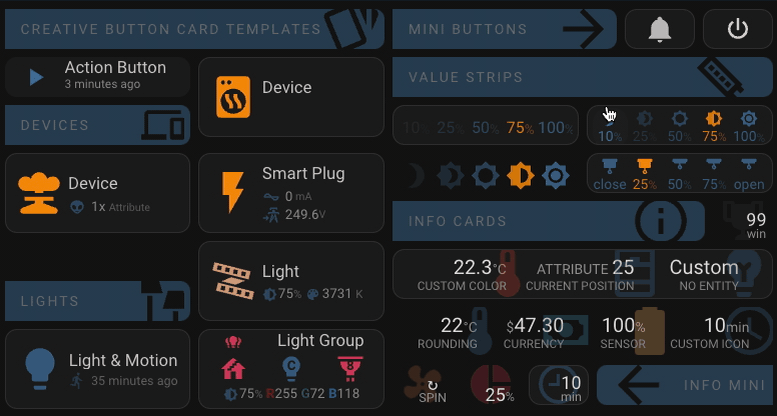

_Examples above are shown in the default dark theme however they should work for most themes. They might require a couple of tweaks here and there. I prefer the excellent [Noctis theme](https://github.com/aFFekopp/noctis) (Check the "See Noctis example..." section below)_

<details><summary>See Noctis example...</summary>
<p>

_Here are the same samples using the [Noctis theme](https://github.com/aFFekopp/n0.1100...12octis)_

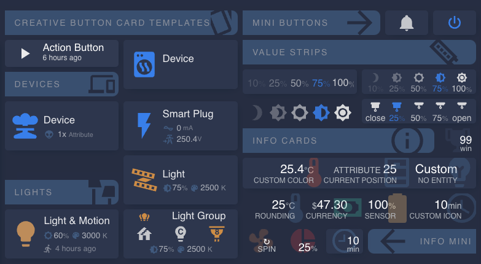

</p>
</details>

<details><summary>See the YAML...</summary>
<p>

This is the code used to create the examples in the gif above. Some entity names omitted, of course.

```yaml
# ...cards:
- type: vertical-stack
  cards:
    - type: custom:button-card #                   ####| Title - Tab & Icon |####>
      template: title
      name: Creative Button Card Templates
      icon: mdi:cards-outline
    - type: grid
      square: false
      columns: 2
      cards:
        - type: vertical-stack
          cards:
            - type: custom:button-card #               ####| Action. Button |####>
              template: button_action
              entity: timer.test_timer
              name: Action Button
            - type: custom:button-card #              ####| Title - Devices |####>
              template: title
              name: Devices
              icon: mdi:cellphone-link
              styles:
                icon:
                  - height: 110%
        - type: custom:button-card #                           ####| Device |####>
          template: device
          entity: switch.sample
          name: Device
          icon: mdi:tumble-dryer
        - type: custom:button-card #              ####| Device - Attributes |####>
          template: device
          entity: switch.sample
          name: Device
          icon: mdi:nuke
          variables:
            attributes:
              - id: voltage
                icon: mdi:alien
                state: '1x '
                units: Attribute
        - type: custom:button-card #                             ####| Plug |####>
          template: plug
          entity: switch.sample
          name: Smart Plug
    - type: grid
      square: false
      columns: 2
      cards:
        - type: custom:button-card #                   ####| Title - Lights |####>
          template: title
          name: Lights
          icon: mdi:lamps
          styles:
            card:
              - margin-top: 40px
        - type: custom:button-card #                            ####| Light |####>
          template: light
          entity: light.sample
          name: Light
        - type: custom:button-card #                   ####| Light - Motion |####>
          template: light_motion
          entity: light.sample
          name: Light & Motion
          variables:
            motion_entity: binary_sensor.sample
        - type: custom:button-card #                      ####| Light Group |####>
          template:
            - light_group
          entity: light.sample
          name: Light Group
          variables:
            items:
              - entity: light.sample
                symbol: mdi:stairs
                icon: mdi:home
              - entity: light.sample
                symbol: C
              - entity: light.sample
                icon: mdi:lightbulb-spot
                symbol: 8
- type: vertical-stack  #                                #########################| COLUMN |#####################>
  cards:
    - type: horizontal-stack #                           ####| Mini Buttons |####>
      cards:
        - type: custom:button-card
          template: title
          name: "Mini Buttons"
          icon: mdi:arrow-right
        - type: custom:button-card #          ####| Button Mini DND |####>
          template:
            - button_mini
            - dynamic_icons
          color_type: card
          color: "#9d3042"
          entity: input_boolean.sample
          variables:
            icon: mdi:bell
            icon_on: mdi:bell-off
            width: 70px
        - type: custom:button-card #        ####| Button Mini Power |####>
          template: button_mini
          icon: mdi:power
          entity: switch.sample
          variables:
            width: 70px
    - type: custom:button-card #                         ####| Value Strips |####>
      template: title
      name: Value Strips
      icon: mdi:led-strip
    - type: grid
      columns: 2
      square: false
      cards:
        - type: custom:button-card #         ####| Brightness Strip |####>
          template:
            - value_strip
          variables:
            type: brightness
            show:
              icon: false
              value: true
          entity: light.sample
        - type: custom:button-card #         ####| Brightness Strip |####>
          template:
            - value_strip
          variables:
            type: adaptive_lighting
            al_area_id: den
            show:
              icon: true
              value: true
        - type: custom:button-card #         ####| Brightness Strip |####>
          template:
            - value_strip
            - transparent
          variables:
            type: adaptive_lighting
            al_area_id: den
            show:
              icon: true
              value: false
        - type: custom:button-card #             ####| Blinds Strip |####>
          template:
            - value_strip
          entity: cover.den_blinds
          variables:
            type: cover
            show:
              icon: true
              value: true
              fade: false
            items:
            - value: 0
              icon: mdi:blinds
              units: '%'
              label: close
            - value: 25
              icon: mdi:blinds
              units: '%'
            - value: 50
              icon: mdi:blinds-open
              units: '%'
            - value: 75
              icon: mdi:blinds-open
              units: '%'
            - value: 100
              icon: mdi:blinds-open
              units: '%'
              label: open
    - type: horizontal-stack #                             ####| Info Cards |####>
      cards:
        - type: custom:button-card
          template: title
          name: Info Cards
          icon: mdi:information-outline
        - type: custom:button-card #                ####| Info Mini |####>
          template:
            - info_mini
            - transparent
          variables:
            state: 99
            units: win
          icon: mdi:trophy
    - type: custom:button-card #                     ####| Info x 3 |####>
      template:
        - info
      variables:
        items:
          - entity_id: sensor.sample
            name: Custom Color
            color: '#e04632'
            decimals: 2
          - entity_id: cover.den_blinds
            attribute: current_position
            units: 'ATTRIBUTE '
            prefix_units: true
          - icon: mdi:lightbulb-variant
            name: No Entity
            state: 'Custom'
    - type: custom:button-card #         ####| Info x 4 Transparent |####>
      template:
        - info
        - transparent
      variables:
        items:
          - entity_id: sensor.sample
            name: Rounding
            decimals: 0
          - icon: mdi:cash
            name: Currency
            state: '47.3'
            units: '$'
            color: "#00b59d"
          - entity_id: sensor.sample
            name: "Sensor"
            color: "#febe6e"
          - entity_id: input_number.air_circulation_frequency
            name: Custom Icon
            icon: mdi:clock-outline
    - type: horizontal-stack #                             ####| Info Minis |####>
      cards:
        - type: custom:button-card #                     ####| Spin |####>
          template:
            - transparent
            - info_mini
          entity: cover.den_blinds
          variables:
            attribute: current_position
            units: 'SPIN'
            state: '↻'
            spin: true
            icon_color: 'rgba(247, 138, 80, 0.2)'
          icon: mdi:fan
        - type: custom:button-card #                   ####| Inline |####>
          template:
            - info_mini
            - transparent
          entity: cover.den_blinds
          icon: mdi:chart-pie
          variables:
            icon_color: 'rgba(157, 48, 66, 0.4)'
            layout: inline
            attribute: current_position
            units: '%'
        - type: custom:button-card #               ####| Background |####>
          template:
            - info_mini
          entity: input_number.air_circulation_frequency
          icon: mdi:clock-time-nine-outline
        - type: custom:button-card #             ####| Mirror Title |####>
          template: title
          name: Info Mini
          icon: mdi:arrow-left
          variables:
            mirror: true
# ...
```

</p>
</details>

 > "What card are you using for that? I want to use that on mine!"

I made this repo for my friends who were asking me the above question. If you're someone else who's managed to stumble accross them then hello and you're welcome to use them. I'll try to keep them maintained for a little while but I am planning on making a proper frontend integration with UI configuration in the future. If you like them then please send your kudos to [@RomRider](https://github.com/RomRider) and everyone who contributed to [Button Card](https://github.com/custom-cards/button-card) which is the only reason these templates were possible.

## Prerequisites

You will need to ensure you have the following components installed. They are both available on [HACS](https://hacs.xyz/).

### [custom-cards/button-card](https://github.com/custom-cards/button-card)

The very first step is to ensure you have [Button Card](https://github.com/custom-cards/button-card) installed and working in home assistant. These templates are not going to work without it! You may notice, as I have, that it hasn't been maintained in some time. However, it all appears to be working perfectly still (_Last Checked HA 2022.10.4_). Perhaps if issues arise I will finally have to bite the bullet and develop my own custom card.

> :raising_hand_man: _If you plan to further extend these templates or create your own then it is **essential** that you read the [button-card documentation](https://github.com/custom-cards/button-card). In fact, I recommend you read it regardless._

### [thomasloven/lovelace-card-mod](https://github.com/thomasloven/lovelace-card-mod)

I've used card-mod for a few tweaks here and there. It's required for most decent custom cards and themes anyway so you may have it already.

## Installation

### YAML Mode

If you are using your lovelace dashboards in [yaml mode](https://www.home-assistant.io/dashboards/dashboards/) (Recommended):

 1. Open a terminal on your Home Assistant host and navigate to the config directory where you keep your `ui-lovelace.yaml`, in hassOS this is usually `/config`.

 2. Clone this repository:

     ```sh
     git clone https://github.com/wfurphy/creative-button-card-templates.git
    ```

 3. Include the following snippet **before the other contents** of your `ui-lovelace.yaml`. _If you've used a custom directory then obviously replace `creative-button-card-templates/` with a relative path to your chosen installation directory._

     ```yaml
     ############| Creative Button Card Templates |#################################################>
     ##| Will Furphy | https://github.com/wfurphy/creative-button-card-templates
     button_card_templates: !include_dir_merge_named creative-button-card-templates/
     #################################################################################/
     ```

### Storage (UI) Mode

If you're using storage mode (or editing your dashboards using the UI):

1. Open a Terminal window and navigate to anywhere you'd like to keep the files then run the following 3 lines:

     ```sh
     git clone https://github.com/wfurphy/creative-button-card-templates.git
     cd creative-button-card-templates
     echo 'button_card_templates:' > cbc.yml && cat */*.yaml *.yaml | sed -n '/^ *#/!p' | sed -n '/^ *$/!p' | sed 's/^/  /' >> cbc.yml
    ```

2. Open `cbc.yml` in your chosen text editor, **select all** and **copy** the entire contents to the clipboard.
3. Open a browser and navigate to your Home Assistant dashboard.
4. Click the three dots in the top right corner and choose `Edit Dashboard`.
5. Click three dots again and choose `Raw Configuration Editor`.
6. On the first line before any other content, **paste** the copied text from `cbc.yml`.
7. Click **Save** and close the raw configuration editor.

## Using the Templates

> :raising_hand_man: _This is all going to make much more sense to you if you have read the [button-card documentation](https://github.com/custom-cards/button-card)._

To use the templates simply specify the `template` property in your button-card yaml. For most you'll need to specify your `entity` (although some don't need it, like `title`). This is all you need for a light card:

```yaml
type: custom:button-card
template: light
entity: light.bedside_lamp
# ...
```

You can use multiple templates and/or addons by defining them as a list in the `template` property. Define the template(s) first then the addons.

```yaml
type: custom:button-card
template:
 - light
 - transparent
entity: light.bedside_lamp
# ...
```

Of course, it's still possible to customise things like `name` and `icon` or other properties available in button-card. Any properties you specify will override the template properties. For example, if I wanted to use a name and icon other than the ones specified in the entity for this light:

```yaml
type: custom:button-card
template: light
entity: light.bedside_lamp
name: Front Door Light
icon: mdi:lamp
# ...
```

> :raising_hand_man: _Some properties are used to provide the features of the template and overriding them will break the functionality. For example the device and light cards make use of the `label` property. However, they should only be one's you are unlikely to use. If you have one that's not working, go and check out the template YAML and check if you're overriding anything vital!_

### Variables

The templates allow you to set most options via the `variables` property. You only ever define one `variables` property, just include any variables from any of the templates or addons that you've specified. Here's an example for a device card with a custom width, 1 attribute and dynamic icons:

```yaml
type: custom:button-card
template:
  - device
  - dynamic_icons
entity: switch.something
variables:
  width: 200px
  attributes:
    - id: that_attribute
      icon: mdi:plus
  icon: "mdi:wifi"
  icon_on: "mdi:wifi-star"
  icon_unavailable: "mdi:wifi-cancel"
# ...
```
## Templates

### Title (`title`)

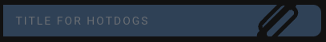

It's what it says on the tin. Title is created from the `name` property and supports an optional `icon`. It has an automatic width and so you can put things next to it in a `horizontal stack` and you can `mirror` it so it goes right-to-left if you need. Examples of these variations can be seen in the image at the beginning of this README.

#### Title Variables

| Variable | Values | Default | Description |
| - | - | - | - |
| `color` | String (CSS) | `var(--primary-background-color)` | The color of the icon |
| `background_color` | String (CSS) | `var(--state-icon-color)` | The color of the background |
| `mirror` | Boolean | `false` | Run right-to-left instead of left-to-right |

#### Title Example YAML

<details><summary>See the YAML...</summary><p>

```yaml
type: custom:button-card
template: title
name: Title for Hotdogs
icon: mdi:hotdog
variables:
  color: var(--primary-background-color)
  background_color: var(--state-icon-color)
  mirror: false
```

</p></details>

### Landscape Button (`button_landscape`)

This template serves as the base template for the `device` and `light` templates. You probably won't need to use it yourself until you step up to the advanced  Through it's configuration and addons which it inherits it has features to reduce the card size and opacity if the entity is unavailable, hide the label containing extra information (like attributes or brightness and color for lights) when the entity is `off`, highlight elements when you hover over it to show it's interactive, set a max-height and include the standard set of `actions`.

> :raising_hand_man: _Remember if a template inherits an addon you can just use those variables to change the properties when using this template. For example; a card with only the `button_landscape` template specified can accept the `width` and `height` variables from the `resizable` addon. This is the case for all templates and addons. Also inheritance is recursive so if a template inherits another template it also inherits that templates inherited templates right back through the chain. So when you use the `light` template you get all of the options listed here as well._

#### Landscape Button Inherits

- state_helper
- style_helper
- [`actions`](#actions-actions)
- [`resizable`](#resizable-resizable)
- interactive

#### Landscape Button Variables

| Variable | Values | Default | Description |
| - | - | - | - |
| `off_hide_info` | Boolean | `true` | Hides the Extra Information or `label` (eg. brightness and color on lights or the attributes on devices) when the entity is off. Set to false if you wish to display this content while the entity is off. _Keep in mind that some attributes are not available when an entity's state is off._ |

### Action Button (`button_action`)

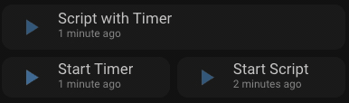

 The Action button is for Automation, Scripts or Timers. It has an animated icon while running and it shows the last run time when idle. You can customise the `name` property which defaults to "Start" and you can also specify a different name while it's running using the `name_on` variable which defaults to "Cancel".

 If you define a `timer` as the `entity` then a tap will start the timer and while active it will show the time remaining and you can tap again to cancel the timer. If you provide a Script or Automation `entity` that starts a timer in it's actions/sequence then you can use the `timer` variable to specify the timer and it will be shown when active, even if the Script/Automation is finished/idle. It will show until the timer runs out or you can double tap to cancel the timer.

#### Action Button Inherits

- state_helper
- style_helper
- [`dynamic_icons`](#dynamic-icons-dynamic_icons)
- [`resizable`](#resizable-resizable)
- interactive

#### Action Button Variables

| Variable | Value Type | Default | Description |
| - | - | - | - |
| `timer` | `timer.*` | | A timer entity that is started by your script. Not required if your `entity` is already a timer.
| `icon_on` | `mdi:*` | `mdi:stop` | Set a custom icon for while the script/timer is running. Inherited from `dynamic_icons`. You can use the card `icon` property to change the default icon (`mdi:play`). |
| `name_on` | String | `Cancel` | Set a custom name for while the script/timer is running. You can use the card `name` property to change the default name (`Start`). |

#### Action Button Example YAML

<details><summary>See the YAML...</summary><p>

```yaml
- type: custom:button-card   #### Action Script with Timer ####>
  template: button_action
  entity: script.test_script
  name: Script with Timer
  variables:
    height: 50px
    timer: timer.test_timer
  triggers_update: timer.test_timer
- type: grid
  square: false
  columns: 2
  cards:
    - type: custom:button-card   #       #### Action Timer ####>
      template: button_action
      entity: timer.test_timer
      name: Start Timer
      variables:
        height: 45px
        name_on: Cancel Timer
    - type: custom:button-card
      template: button_action
      entity: script.test_script_2 #    #### Action Script ####>
      name: Start Script
      variables:
        height: 45px
        name_on: Stop Script
```

</p></details>

### Mini Button (`button_mini`)

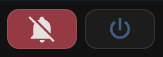

This is a little button which only displays an icon with the option of defining a single text character or another icon as a symbol which will display in front of the main icon. These are great for in a `horizontal-stack` next to the title to control a group or for things like Do Not Disturb (DND) toggles. Of course you can use them for whatever you need. I nearly always add [`dynamic_icons`](#dynamic-icons-dynamic_icons) to them.

> :raising_hand_man: _The first button in the examples is using the button-card `color_type` property set to `card`. Check out all the [button-card options here]_(https://github.com/custom-cards/button-card)

#### Mini Button Inherits

- style_helper
- state_helper
- [`actions`](#actions-actions)
- show_only_icon
- [`resizable`](#resizable-resizable)
- interactive

#### Mini Button Variables

| Variable | Values | Default | Description |
| - | - | - | - |
| `symbol` | Single Character String OR `mdi:*` |  | A single character of text or an icon to identify the light |
| `symbol_width` | String (CSS) | `50%` | Only applies if the `symbol` is an icon (`mdi:*`). Adjust if the symbol doesn't fit |
| `symbol_font_size` | String (CSS) | `10pt` | Only applies if the `symbol` is a string. Adjust if the symbol doesn't fit |
| `symbol_color` | String (CSS) | `var( --ha-card-background, var(--card-background-color, white) )` | Set a custom symbol color |

#### Mini Button Example YAML

<details><summary>See the YAML...</summary><p>

_See examples of symbol usage in the [`light_group` section](#light-group-light_group)._

```yaml
- type: custom:button-card #          ####| Button Mini DND |####>
  template:
    - button_mini
    - dynamic_icons
  color_type: card
  color: "#9d3042"
  entity: input_boolean.do_not_disturb
  variables:
    icon: mdi:bell
    icon_on: mdi:bell-off
    width: 70px
- type: custom:button-card #        ####| Button Mini Power |####>
  template: button_mini
  icon: mdi:power
  entity: switch.all_things
  variables:
    width: 70px
```

</p></details>

### Device (`device`)

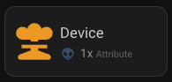

For any `entity` which has on/off state. It can optionally display up to 2 `attributes` from the entity with custom icons, values and units.

> :raising_hand_man: _If you don't know what attributes are available on your entity you can use the more-info dialogue or check out the [`entity_details` template](#detailed-entity-information-entity_detail)_

#### Device Inherits

- `button_landscape`

#### Device Variables

| Variable | Value Type | Default | Description |
| - | - | - | - |
| `attributes` | Array of [Attribute Items](#attribute-item) | `[]` | A list of up to 2 Attribute Item objects. See [Attribute Item](#attribute-item) below for available properties. |
| `attribute_icon_color` | String (CSS) |  | Set a custom color for the attribute icons. |

#### Attribute Item

| Property | Value Type | Default | Description |
| - | - | - | - |
| `id` | `entity.attributes.*` |  | The id of the attribute to display eg. `friendly_name`. _Required_ |
| `icon` | `mdi:*` |  | The icon to use for the attribute. |
| `units` | String |  | The unit of measurement (if required) for the attribute value. |
| `prefix_units` | Boolean | `false` | When `true` units will appear before the value. |

#### Device Example YAML

<details><summary>See the YAML...</summary><p>

```yaml
type: custom:button-card
template: device
entity: switch.wmd_activate
name: Device
icon: mdi:nuke
variables:
  attributes:
    - id: voltage
      icon: mdi:alien
      units: Attribute
```

</p></details>

### Smart Plug (`plug`)

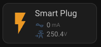

Intended for use with smart plugs which have energy metering attributes. Add the smart plug `entity` and you're good to go.

#### Plug Inherits

- `device`

#### Plug Extra information

- **Current:** The current being used currently (lol) from the `current` attribute.
- **Voltage:** The voltage from the `voltage` attribute.

#### Plug Example YAML

<details><summary>See the YAML...</summary>
<p>

```yaml
type: custom:button-card
template: plug
entity: switch.smart_plug
name: Smart Plug
```

</p>
</details>

### Light (`light`)

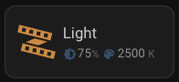

For use with light entities. Just specify the `entity` and the template should do the rest of the work for you. The icon color is set to `auto` so will mimic the current color of the light. _This is a button-card feature and it uses the `--button-card-light-color` css variable_

#### Light Inherits

- `button_landscape`

#### Light Extra Information

- **Effects:** If the entity is currently running an effect it will display the effect name derived from the `effect` attribute.

When there is not an effect running:

- **Brightness:** The brightness percentage will be displayed calculated from the `brightness` attribute.
- **Color:** When the entity's attribute `color_mode` is set to `color_temp` the color temperature in degrees Kelvin will be displayed otherwise the `rgb_color` attribute will be displayed.

### Light with Motion Sensor (`light_motion`)

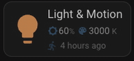

For use with light entities which are controlled by a motion or occupancy sensor. Shows the extra information of the light as well as when occupancy/motion is or was last detected. You specify the light `entity` for the card and then the sensor in the `motion_entity` variable. _The automation for activating the light must already be configured. This button does not provide an automation._

#### Light Motion Inherits

- [`light`](#light-light)

#### Light Motion Variables

| Variable | Values | Default | Description |
| - | - | - | - |
| `motion_entity` | `binary_sensor.*` |  | The `entity_id` of the motion/occupancy sensor which activates the light in your automation. |

#### Light Motion Example YAML

<details><summary>See the YAML...</summary><p>

```yaml
type: custom:button-card
template: light_motion
entity: light.my_light
variables:
  motion_entity: binary_sensor.my_motion_sensor
```

</p></details>

### Light Group (`light_group`)

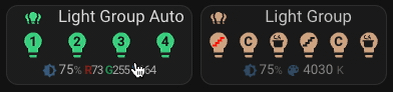

For use with small light groups (up to 6) like multi-globe lamps. Specify a light group and you can have up to 6 separate lights with custom icons and symbols all controlled on one card. The main card controls the group and each individual light can be controlled from an embedded `button_mini`.

If you're feeling lazy then just specify the light group `entity` and up to the first 6 lights from the group will be automagically added to the card for you with lightbulb icons and numbered 1-_n_. Alternatively you can specify the list of lights manually and control the icons and symbols that are used.

#### Light Group Inherits

- [`light`](#light-light)

#### Light Group Variables

| Variable | Values | Default | Description |
| - | - | - | - |
| `items` | Array of [Light Items](#light-item) | `[]` | A list of up to 6 lights to display. See the [Light Item](#light-item) table below for available properties. |

#### Light Item

| Property | Values | Default | Description |
| - | - | - | - |
| `entity` | `light.*` | | The `entity_id` of the light _Required_ |
| `icon` |  `mdi:*` | `mdi:lightbulb` | The icon for the light. |
| `symbol` | Single Character String OR `mdi:*` |  | A single character of text or an icon to identify the light |
| `symbol_width` | String (CSS) | `50%` | Only applies if the `symbol` is an icon (`mdi:*`). Adjust if the symbol doesn't fit |
| `symbol_font_size` | String (CSS) | `10pt` | Only applies if the `symbol` is a string. Adjust if the symbol doesn't fit |
| `symbol_color` | String (CSS) | `var( --ha-card-background, var(--card-background-color, white) )` | Set a custom symbol color |

#### Light Group Example YAML

<details><summary>See the YAML...</summary><p>

```yaml
#...
  - type: custom:button-card #                 ####| Light Group Auto |####>
    template:
      - light_group
    entity: light.light_group
    name: Light Group Auto
  - type: custom:button-card #               ####| Light Group Custom |####>
    template:
      - light_group
    entity: light.light_group_passage
    name: Light Group
    variables:
      items:
        - entity: light.stairs
          symbol: mdi:stairs_left
          symbol_color: red
        - entity: light.cabinet_left
          symbol: C
        - entity: light.kitchen_left
          symbol: mdi:pot-steam
        - entity: light.stairs_right
          symbol: mdi:stairs
        - entity: light.cabinet_right
          symbol: C
        - entity: light.kitchen_right
          symbol: mdi:pot-steam
```

</p></details>

### Value Strip (`value_strip`)

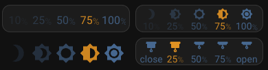

Value strips can be used to control anything which has a gradual, numeric value. The most obvious examples are brightness / color of lights, covers position (like blinds and garage doors) or temperature for environmental controls. Let your imagination run wild though, they can be customised and used for anything you like. They give you quick tap access to 5 pre-set values and if the value of an item matches the value of the target then they are set to active and highlighted.

There are two pre-built options, `brightness` and `cover`, for you to use which are available by [setting the `type` variable](#value-strip-types).


#### Value Strip Variables

| Variable | Property | Values | Default | Description |
| - | - | - | - | - |
| `type` | | `value` \| `brightness` \| `cover` | `value` | The type of value strip. See [Value Strip Types](#value-strip-types) below for descriptions of the available values. |
| `show`: | ... | Object | | The following properties allow you to enable / disable some of the design features. There's an example of all the options in the image above. |
| | `icon` | Boolean | `true` | Show the icon for each value |
| | `value` | Boolean | `true` | Show the value text and units for each value |
| | `fade` | Boolean | `true` | Fade the items according to their value (best with `brightness`) |
| `items` | | Array of [value strip items](#value-strip-item) | See [Value Strip Types](#value-strip-types) | Define the items in your `value_strip`. See [value strip item](#value-strip-item) below for available properties.

#### Value Strip Types

- **`value`:** _(default)_  This is for creating completely custom Value Strips. You will need to provide the array of `items` to define all 5 items in the strip.
- **`brightness`:** This is for use with a light entity and has five percentage values for brightness. It has the `light.turn_on` service configured in the `tap_action` and highlights the matching value by calculating the brightness percentage from `light.attributes.brightness`. <details><summary>Default items...</summary><p>

  ```yaml
  items:
    - value: 10
      units: '%'
      icon: mdi:brightness-3
    - value: 25
      units: '%'
      icon: mdi:brightness-4
    - value: 50
      units: '%'
      icon: mdi:brightness-5
    - value: 75
      units: '%'
      icon: mdi:brightness-6
    - value: 100
      units: '%'
      icon: mdi:brightness-7
  ```

</p></details>

- **`cover`:** This is for use with blinds or similar. It has the `cover.set_position` service configured in the `tap_action` and matches the active value using `entity.attributes.current_position`. <details><summary>Default items...</summary><p>

  ```yaml
  items:
    - value: 0
      icon: mdi:blinds
      prefix: ''
      units: '%'
      label: close
    - value: 25
      icon: mdi:blinds
      units: '%'
    - value: 50
      icon: mdi:blinds-open
      units: '%'
    - value: 75
      icon: mdi:blinds-open
      units: '%'
    - value: 100
      icon: mdi:blinds-open
      units: '%'
      prefix: ''
      label: open
  ```

</p></details>

#### Value Strip Item

| Property | Values | Default | Description |
| - | - | - | - |
| `value` | Number | | The value to of this item. Used for the action and for display. _Required_ |
| `icon` | `mdi:*` | | The icon for this item |
| `units` | String | | The unit of measurement for the item |
| `prefix` | String | | Any text you would like to prefix before the value. |
| `label` | String | | If provided the label will be displayed instead of the value |
| `color` | String (CSS) | `var(--paper-item-icon-color)` | The color of the item |
| `active_color` | String (CSS) | `var(--button-card-light-color, var(--accent-color))` | The color of the item when it is active (it matches the target value) |

#### Value Strip Example YAML

<details><summary>See the YAML...</summary><p>

_These aren't the same as the example images, no need to include too much YAML!_

```yaml
#...
- type: custom:button-card #      ####| Brightness Strip, Transparent, Only Icons |####>
  template:
    - value_strip
    - transparent
  variables:
    type: brightness
    al_area_id: den
    show:
      icon: true
      value: false
- type: custom:button-card #   ####| Custom Cover Strip, Icons and Value, No Fade |####>
  template: value_strip
  entity: cover.den_blinds
  variables:
    type: cover
    show:
      icon: true
      value: true
      fade: false
    items:
    - value: 0
      icon: mdi:blinds
      units: '%'
      label: close
    - value: 25
      icon: mdi:blinds
      units: '%'
    - value: 50
      icon: mdi:blinds-open
      units: '%'
    - value: 75
      icon: mdi:blinds-open
      units: '%'
    - value: 100
      icon: mdi:blinds-open
      units: '%'
      label: open
```

</p></details>

### Info Card (`info`)

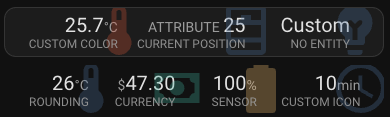

The Info card is for displaying entities and their states or attributes. It's great for displaying sensors. You can display up to 4 items in an info card.

#### Info Inherits

- no_actions

#### Info Variables

| Variable | Values | Default | Description |
| - | - | - | - |
| `items` | Array of [Info Items](#info-item) | `[]` | A list of up to 4 items. See the [Info Item](#info-item) table below for available properties _Required_ |
| `mini` |  Boolean | `false` | Display using the `info_mini` template rather than the `info_item` one |
| `icon_color` | String (CSS) | `var(--state-icon-color, var(--paper-item-icon-color))` | Set the color of the icons. This will be overridden by a `color` set on any individual items.  |

#### Info Item

| Property | Values | Default | Description |
| - | - | - | - |
| `entity_id` | Any entity | | The `entity_id` of the item |
| `attribute` | `entity.attributes.*` | | The id of any attribute of the entity specified above. If provided the value of the attribute will be used rather than the entity state. |
| `state` | String | | Providing this will completely override the `entity_id` and `attribute` states and display this string instead. You don't need to specify an `entity_id` if you use this. |
| `units` | String | The entity attribute `unit_of_measurement` | Set a custom unit of measurement for the displayed value |
| `prefix_units` | Boolean | `false` | Display the `units` in front of the value rather than after. Automatically `true` for `$` and `€` units |
| `decimals` | Number | | Round the value to the specified number of decimal places (`0` for a whole number). Automatically `2` for `$` and `€` units |
| `name` | String | The entity `friendly_name` or the attribute name | Set a custom display name for the item |
| `icon` |  `mdi:*` | The entity icon | The icon for the entity. |
| `color` | String (CSS) | `variables.icon_color` | Set a custom color for the icon |

#### Info Example YAML

<details><summary>See the YAML...</summary><p>

```yaml
# ...
- type: custom:button-card #                     ####| Info x 3 |####>
  template: info
  variables:
    items:
      - entity_id: sensor.temperature
        name: Custom Color
        color: '#e04632'
        decimals: 2
      - entity_id: cover.blinds
        attribute: current_position
        units: 'ATTRIBUTE '
        prefix_units: true
      - icon: mdi:lightbulb-variant
        name: No Entity
        state: 'Custom'
- type: custom:button-card #         ####| Info x 4 Transparent |####>
  template:
    - info
    - transparent
  variables:
    items:
      - entity_id: sensor.temperature
        name: Rounding
        decimals: 0
      - icon: mdi:cash
        name: Currency
        state: '47.3'
        units: '$'
        color: "#00b59d"
      - entity_id: sensor.battery
        name: "Sensor"
        color: "#febe6e"
      - entity_id: input_number.some_counter
        name: Custom Icon
        icon: mdi:clock-outline
```

</p></details>

### Mini Info (`info_mini`)

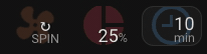

Displays the icon and state of an entity only. Good for displaying information next to a `title` in a `horizontal-stack`. You can choose between `stack` and `inline` layouts for the state and units. Specify the `entity` and optionally `icon` properties then the other options are in `variables`.

#### Mini Info Variables

| Variable | Values | Default | Description |
| - | - | - | - |
| `layout` | `stack` \| `inline` | `stack` | `stack` will show the state with units underneath and `inline` shows the state followed by the units. |
| `attribute` | `entity.attributes.*` | | The id of any attribute of the entity specified above. If provided the value of the attribute will be used rather than the entity state. |
| `state` | String | | Providing this will completely override the `entity` and `attribute` states and display this string instead. |
| `units` | String | The entity attribute `unit_of_measurement` | Set a custom unit of measurement for the displayed value |
| `prefix_units` | Boolean | `false` | Display the `units` in front of the value rather than after. Automatically `true` for `$` and `€` units |
| `decimals` | Number | | Round the value to the specified number of decimal places (`0` for a whole number). Automatically `2` for `$` and `€` units |
| `icon_color` | String (CSS) | `var(--state-icon-color, var(--paper-item-icon-color))` | Set a custom color for the icon |

#### Mini Info Example YAML

<details><summary>See the YAML...</summary><p>

```yaml
# ...
- type: custom:button-card #                     ####| Spin |####>
  template:
    - transparent
    - info_mini
  entity: cover.den_blinds
  variables:
    attribute: current_position
    units: 'SPIN'
    state: '↻'
    spin: true
    icon_color: 'rgba(247, 138, 80, 0.2)'
  icon: mdi:fan
- type: custom:button-card #                   ####| Inline |####>
  template:
    - info_mini
    - transparent
  entity: sensor.percentage
  icon: mdi:chart-pie
  variables:
    icon_color: 'rgba(157, 48, 66, 0.4)'
    layout: inline
    attribute: current_position
    units: '%'
  - type: custom:button-card #               ####| Background |####>
    template: info_mini
    entity: input_number.some_time
    icon: mdi:clock-time-nine-outline
```

</p></details>

## Addons

You can use any addon by including it after your template in a list as shown in the example above. Addons with a star (*) are included in _most_ button templates already.

### Actions (`actions`)*

The `actions` addon will add the `toggle` action for single tap and `more-info` action for hold and double tap as well as the haptic `success` for the iOS app. It's included in most of the button templates by default.

### No Actions (`no_actions`)

The `no_actions` addon does the opposite of above. It removes the standard functionality and sets your card to have no actions.

### Dynamic Icons (`dynamic_icons`)

The `dynamic_icons` addon will add functionality to the card which will change the icon dependant on the state of the entity. It works for all entities that have an "on" and "off" state.

> :raising_hand_man: _If you just want to have a static custom icon for your card then it's easiest just to populate the `icon` property._

#### Dynamic Icon Variables

| Variable | Values | Default | Description |
| - | - | - | - |
| `icon` | `mdi:*` | `mdi:wifi` | The icon to display when the entity is off. |
| `icon_on` | `mdi:*` | `mdi:wifi-star` | The icon to display when the entity is on. |
| `icon_unavailable` | `mdi:*` | `mdi:wifi-cancel` | The icon to display when the entity is unavailable. |

### Resizable (`resizable`)*

The `resizable` addon allows you to use `height` and `width` variables to define the size of the card (some templates have min or max sizes set though). It's added to most button templates already so you only need to include the variables to set a custom size for your card.

#### Resizable Variables

| Variable | Values | Default | Description |
| - | - | - | - |
| `height` | String (CSS) | _per card_ | The height of the card in any CSS accepted value. Eg `40px` or `90%` |
| `width` | String (CSS) | _per card_ | The width of the card in any CSS accepted value. Eg `40px` or `90%` |

### Transparent (`transparent`)

The `transparent` addon will make the background of your card transparent, remove it's `box-shadow` and `border`. I find this looks great with `value_strip` and `info_mini` templates but you can use it on any you like.

## Advanced Usage

If you've poked around the files or read any of the **Inherits** lists you will notice . They were ones that I used in creation of the templates but you won't need them unless you're making your own templates or advanced changes. I'll document them soon but in the interest of actually getting this release out I'm going to assume if you're doing advanced stuff you can check them out and use them accordingly.

_A special mention for `debug` and `entity_detail` which are included below._

### Debug

When added to a card's `template` list `debug` will write a `console.debug()` containing objects that can help you figure out what's happening. So in your browser inspector console you can see the button-card (`this`), the `variables` and the `entity` objects. It comes in handy if things aren't working. If you're going to submit a issue on GitHub you'll need to be able to get this info. Remember to set the level of your browser console to All so you can see the debug messages._

### Detailed Entity Information (`entity_detail`)

Mostly used for creating and debugging the templates this card displays the full properties and attributes of an entity in a table.

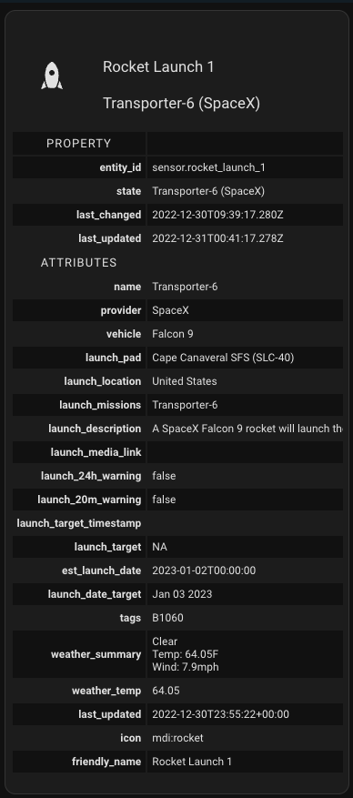

## Thanks

 Massive thanks to [@RomRider](https://github.com/RomRider) and everyone who contributed to [Button Card](https://github.com/custom-cards/button-card) which is the only reason these templates were possible.
