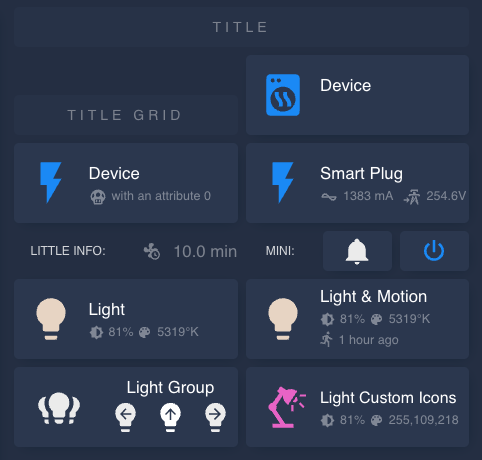
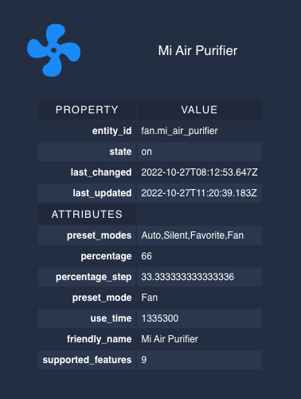

# Custom Button Card Templates

A collection of [Button Card](https://github.com/custom-cards/button-card) templates to improve the speed and quality of your Home Assistant dashboards.



_Examples in the image are using the [Noctis](https://github.com/aFFekopp/noctis) theme by @eFFekopp but should work with any theme you choose._

<details><summary>See the code...</summary>
<p>

```yaml
- type: vertical-stack
    cards:
      - type: custom:button-card
        template: title
        name: Title
      - type: grid
        square: false
        columns: 2
        cards:
          - type: custom:button-card
            template: title_grid
            name: Title Grid
          - type: custom:button-card
            template: device
            entity: switch.smart_plug
            name: Device
          - type: custom:button-card
            template: device
            entity: switch.smart_plug
            name: Device
            variables:
              _show_attributes: 1
              _attr_id: current
              _attr_icon: mdi:one-up
              _attr_prefix: "with an attribute "
          - type: custom:button-card
            template: plug
            entity: switch.smart_plug_3
            name: Smart Plug
          - type: horizontal-stack
            cards:
              - type: custom:button-card
                template: title
                name: "Little Info:"
                styles:
                  card:
                    - background: none
                    - opacity: 0.8
                  name:
                    - letter-spacing: auto
                    - line-height: 18px
                    - font-size: 12px
                    - text-align: center
              - type: custom:button-card
                template: little_info
                entity: input_number.circulation_frequency
          - type: horizontal-stack
            cards:
              - type: custom:button-card
                template: title
                name: "Mini:"
                styles:
                  card:
                    - background: none
                    - opacity: 0.8
                  name:
                    - letter-spacing: auto
                    - line-height: 18px
                    - font-size: 12px
                    - text-align: center
              - type: custom:button-card
                template: button_mini
                icon: mdi:bell
                entity: switch.smart_plug
              - type: custom:button-card
                template: button_mini
                icon: mdi:power
                entity: switch.smart_plug
          - type: custom:button-card
            template: light
            entity: light.light_name
            name: Light
          - type: custom:button-card
            template: light_motion
            entity: light.light_name
            name: Light & Motion
            variables:
              _motion_entity: binary_sensor.occupancy
          - type: custom:button-card
            template:
              - light_group
            entity: light.multiple_globe_light
            name: Light Group
            variables:
              _light1: light.left
              _light2: light.top
              _light3: light.right
          - type: custom:button-card
            template:
              - light
              - dynamic_icons
            entity: light.light_name
            name: Light Custom Icons
            variables:
              _icon: mdi:desk-lamp
              _icon_on: mdi:desk-lamp-on
              _icon_unavailable: mdi:desk-lamp-off
            styles:
              name:
                - font-size: 95%
```

</p>
</details>

 > "What card are you using for that? I want to use that on mine!"

I made this repo for my friends who were asking me the above question. If you don't know me and somehow managed to stumble across these then feel free to use them but please be aware that there's no guarantee that they will be maintained, that they are not going to break your dashboard or that they even work the way they are described! **Use them at your own risk.** If you like them then please send your kudos to @RomRider for creating [Button Card](https://github.com/custom-cards/button-card) which is the only reason these templates were possible.

## Prerequisites

You will need to ensure you have the following components installed. They are both available on [HACS](https://hacs.xyz/).

### [custom-cards/button-card](https://github.com/custom-cards/button-card)

The very first step is to ensure you have [Button Card](https://github.com/custom-cards/button-card) installed and working in home assistant. These templates are not going to work without it! You may notice, as I have, that it hasn't been maintained in some time. However, it all appears to be working perfectly still (_Last Checked HA 2022.10.4_). Perhaps if issues arise I will finally have to bite the bullet and develop my own custom card.

> If you plan to further extend these templates or create your own then it is **essential** that you read the [button-card documentation](https://github.com/custom-cards/button-card).

### [thomasloven/lovelace-card-mod](https://github.com/thomasloven/lovelace-card-mod)

I've used card-mod for a few tweaks here and there. It's required for most decent custom cards and themes anyway so you may have it already.

## Installation

### YAML Mode

If you are using your lovelace dashboards in [yaml mode](https://www.home-assistant.io/dashboards/dashboards/) already:

 1. Navigate to the home assistant `config` directory where you keep your `ui-lovelace.yaml`, in hassOS this is usually:

  ```sh
   cd /config/ui-lovelace.yaml
   ```

 2. Either;
    1. Clone this repository (recommended as updates will be much easier)

    ```sh
    git clone https://github.com/wfurphy/ha-button-card-templates.git
    ```

    1. **OR**; Make a new folder called `ha-button-card-templates/` or a custom name if you choose, download the latest release and copy the entire contents to this location.

 3. Include the following snippet at the top of your `ui-lovelace.yaml`. _If you've used a custom directory then obviously replace `ha-button-card-templates/` with a relative path to your installation directory._

```yaml
############| HA Button Card Templates |###########################################>
#### Some templates for the custom button cards I use in Home Assistant.
#### Will Furphy | https://github.com/wfurphy/ha-button-card-templates
#### Requires: https://github.com/custom-cards/button-card
button_card_templates: !include_dir_merge_named ha-button-card-templates/
###########################################################################/
```

### Storage (UI) Mode

If you're using storage mode (or editing your dashboards using the UI):

1. Clone this repository anywhere you like then navigate to the directory in your terminal and run the following command:

```sh
cat *.yaml >> all.yaml
```

2. Open `all.yaml` in your chosen editor and copy the entire contents.
3. Open a browser and navigate to your Home Assistant dashboard.
4. Click the three dots in the top right corner and choose `Edit Dashboard`.
5. Click three dots again and choose `Raw Configuration Editor`.
6. Paste the copied template yaml at the very top.
7. Save and close the raw configuration editor.

## Using the Templates

You can override any button-card options in the yaml on each card but be aware that if you do you may overwrite the functionality of the template. Read the [button-card documentation](https://github.com/custom-cards/button-card) and see the code for the samples for more information.

To use the templates simply specify the `template` property in your button-card yaml:

```yaml
type: custom:button-card
template: device
entity: switch.entity_name
# ...
```

You can use multiple templates and/or addons by defining them as a list. Define the addons after the base template. Then include the `variables` to customise the template:

```yaml
type: custom:button-card
template:
  - device
  - dynamic_icons
entity: switch.entity_name
variables:
  _icon: "mdi:wifi"
  _icon_on: "mdi:wifi-star"
  _icon_unavailable: "mdi:wifi-cancel"
# ...
```
## Addons

### Dynamic Icons Addon (`dynamic_icons`)

The `dynamic_icons` addon template will add functionality to the card which will change the icon dependant on the state of the entity.

> _If you just want to have a static custom icon for your card then it's easiest just to populate the `icon` property. However, it is essential that you **DO NOT populate the `icon` property** if you are using this dynamic icons template!_

#### Variables

| Variable | Values | Default | Description |
| - | - | - | - |
| `_icon` | `mdi:*` | `mdi:wifi` | The icon to display when the entity is off. |
| `_icon_on` | `mdi:*` | `mdi:wifi-star` | The icon to display when the entity is on. |
| `_icon_unavailable` | `mdi:*` | `mdi:wifi-cancel` | The icon to display when the entity is unavailable. |

### Debug (`debug`)

An advanced addon which will display a tooltip with the entity name on hover and log the relevant javascript objects in the browser console.


## Templates

### Title (`title`)

It's what it says on the tin. Title is created from the `name` property.

### Grid Title (`title_grid`)

To be used next to a full height card. This title will stick to the bottom of it's grid section.

### Landscape Button (`button_landscape`)

This template serves as the base template for most other templates and sets the layout. It has custom css rules making the button reduce opacity if the entity is unavailable and hide the extra information, such as brightness and color on lights, when the entity is off.

### Mini Button (`button_mini`)

For buttons which are half the hight and only display an icon. Best used in a `horizontal-stack`.

### Little Info Snippet (`little_info`)

Displays the `icon` and `state` of an entity with no card background and less opacity. Good for displaying information next to a mini button or title in a `horizontal-stack`.

### Device (`device`)

For any generic entity which has on/off state. It can optionally display up to 2 attributes from the entity with custom icons, prefixes and suffixes.

#### Inherits

 * `button_landscape`

#### Variables

_The `_attr_*` variables will be ignored unless `_use_attributes` is greater than `0` and `_attr2_*` variables are ignored unless `_use_variables` is `2`._

| Variable | Values | Default | Description |
| - | - | - | - |
| `_use_attributes` | `0-2` | `0` | Specify the number of attributes to display. |
| `_attr_id:` | `entity.attributes.*` |  | The id of the attribute to display. _Required if `_use_attributes` > `0`_ |
| `_attr_icon:` | `mdi:*` |  | The icon to use for the attribute. _Optional_ |
| `_attr_prefix:` | String |  | Any custom text or symbol to preface the attribute state. _Optional_ |
| `_attr_suffix:` | String |  | Any custom text or symbol to follow the attribute state. _Optional_ |
| `_attr2_id:` | `entity.attributes.*` |  | The id of the second attribute to display. _Required if `_use_attributes` = `2`_ |
| `_attr2_icon:` | `mdi:*` |  | The icon to use for the second attribute. _Optional_ |
| `_attr2_prefix:` | String |  | Any custom text or symbol to preface the second attribute state. _Optional_ |
| `_attr2_suffix:` | String |  | Any custom text or symbol to follow the second attribute state. _Optional_ |

### Smart Plug (`plug`)

Intended for use with smart plugs which have energy metering attributes.

#### Inherits

 * `button_landscape`

#### Extra information

* **Current:** The current being used currently (lol) from the `current` attribute.
* **Voltage:** The voltage from the `voltage` attribute.

### Light (`light`)

For use with light entities and especially good for ones with RGBIC (separate white / color temperature LEDs as well as rgb ones). The icon `color` is set to `auto` so will mimic the current color of the light.

#### Inherits

 * `button_landscape`

#### Extra Information

 * **Effects:** If the entity is currently running an effect it will display the effect name derived from the `effect` attribute.

When there is not an effect running:

 * **Brightness:** The brightness percentage will be displayed calculated from the `brightness` attribute.
 * **Color:** When the entity's attribute `color_mode` is set to `color_temp` the color temperature in degrees Kelvin will be displayed otherwise the `rgb_color` attribute will be displayed.

### Light with Motion Sensor (`light_motion`)

For use with light entities which are controlled by a motion or occupancy sensor. Shows the extra information of the light as well as when occupancy/motion is or was last detected. _The automation for activating the light must already be configured. This button does not provide an automation._

#### Inherits

 * `button_landscape`
 * `light`

#### Variables

| Variable | Values | Default | Description |
| - | - | - | - |
| `_motion_entity` | `binary_sensor.*` |  | The `entity_id` of the motion/occupancy sensor which activates the light in your automation. |

### Light Group

For use with small light groups like multi-globe lamps. The `entity` should be a light group and you can have up to 3 separate lights with custom icons and symbols all controlled on one card.

#### Variables

| Variable | Values | Default | Description |
| - | - | - | - |
| `_light1` | `light.*` | | The `entity_id` of the first light |
| `_light1_icon` |  `mdi:*` | `mdi:lightbulb` | The icon for the first light. |
| `_light1_symbol` |  `mdi:*` | `mdi:arrow-left` | The icon for the first light. |
| `_light2` | `light.*` | | The `entity_id` of the second light
| `_light2_icon` |  `mdi:*` | `mdi:lightbulb` | The icon for the second light. |
| `_light2_symbol` |  `mdi:*` | `mdi:arrow-up` | The icon for the second light. |
| `_light3` | `light.*` | | The `entity_id` of the third light
| `_light3_icon` |  `mdi:*` | `mdi:lightbulb` | The icon for the third light. |
| `_light3_symbol` |  `mdi:*` | `mdi:arrow-right` | The icon for the third light. |

### Detailed Entity Information (`entity_detail`)

Mostly used for creating and debugging the templates this card displays the full properties and attributes of an entity in a table with no card background.


