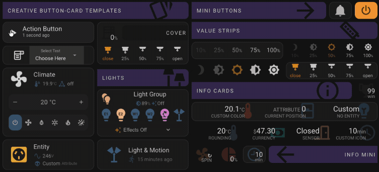

# Creative Button-Card Templates


A collection of [Button Card](https://github.com/custom-cards/button-card) templates to improve the build speed and quality of your Home Assistant Lovelace dashboards.



_Examples above are shown in the default dark theme however they should work for most themes. They might require a couple of tweaks here and there. I prefer the excellent [Noctis theme](https://github.com/aFFekopp/noctis)._

> "What card are you using for that? I want to use that on mine!"

I made this repo for my friends who were asking me the above question. If you're someone else who's managed to stumble across them then hello and you're welcome to use them.

## v0.3.0+

It's been a long time coming! I'll _try_ to make the updates more frequent, plenty in this release to keep you busy though...

- Now compatible with Button-Card 7!
- New templates, new features on existing cards and ALL the bug fixes!
- There are a few little breaking changes which I've tried to call out in the docs.
- There's a much easier way to install for Storage (UI) mode.
- There's an update checker so you'll know when there's an update available.
- It's still home-ware so expect some glitches, log issues here and I will try my best to fix them.
- Feature suggestions are welcome and please show me what you're building with them! I really want to see what you're creating!

If you're updating from a previous version, checkout the [Updating](docs/getting-started.md#updating) section for instructions.

> :raising_hand_man: If you're updating then make sure to keep an eye out for the breaking changes which are highlighted throughout the docs like this: 🧨 _Breaking Change:_

## Docs

The docs have grown up a little and now live in a GitHub Pages site so they're easier to browse, search and keep tidy. If you're just here to use the templates, start with the install docs and then have a browse through the examples and template reference.

- [Getting Started](docs/getting-started.md)
- [Examples](docs/examples.md)
- [Templates](docs/templates.md)
- [Addons](docs/reference/addons.md)
- [Helpers](docs/reference/helpers.md)
- [Advanced Usage](docs/reference/advanced-usage.md)
- [Customisation](docs/customisation.md)

The published site is configured here:

https://wfurphy.github.io/creative-button-card-templates/

## Quick Install Reminder

If you're using Lovelace YAML mode, clone this repository into your Home Assistant config directory and include it before any other dashboard content:

```yaml
####| Creative Button-Card Templates |#################################################>
####| Will Furphy | https://github.com/wfurphy/creative-button-card-templates
button_card_templates: !include_dir_merge_named creative-button-card-templates/
#################################################################################/
```

If you're using Storage (UI) mode, copy the generated `cbc.yml` from the latest release into the Raw Configuration Editor. The [Getting Started](docs/getting-started.md) docs have the full steps for both methods.

## Local Docs

If you're working on the docs locally:

```sh
python3 -m venv .venv
.venv/bin/python -m pip install -r requirements-docs.txt
.venv/bin/mkdocs serve
```

Build the site with:

```sh
.venv/bin/mkdocs build --strict
```

## Thanks

Massive thanks to [@RomRider](https://github.com/RomRider) and everyone who contributed to [Button Card](https://github.com/custom-cards/button-card) which is the only reason these templates were possible.

And thanks to all of you for your patience while it's been too long between updates! I'd love to see what you're building with the templates. Post some images of your dashboards on the [Home Assistant Forum thread](https://community.home-assistant.io/t/creative-button-card-templates-for-lovelace-dashboards/515667).
