# Creative Button-Card Templates


A collection of [Button Card](https://github.com/custom-cards/button-card) templates to improve the build speed and quality of your Home Assistant lovelace dashboards.

## TODO: Update Image and Code


_Examples above are shown in the default dark theme however they should work for most themes. They might require a couple of tweaks here and there. I prefer the excellent [Noctis theme](https://github.com/aFFekopp/noctis)_

<details><summary>See the YAML...</summary>
<p>

This is the code used to create the examples in the gif above. Some entity names omitted, of course.

```yaml
# ...cards:
- type: vertical-stack
  cards:
    - type: custom:button-card #                   ####| Title - Tab & Icon |####>
      template: title
      name: Creative Button-Card Templates
      icon: mdi:cards-outline
    - type: grid
      square: false
      columns: 2
      cards:
        - type: vertical-stack
          cards:
            - type: custom:button-card #               ####| Action. Button |####>
              template: button_action
              entity: timer.test_timer
              name: Action Button
            - type: custom:button-card #              ####| Title - Devices |####>
              template: title
              name: Devices
              icon: mdi:cellphone-link
              styles:
                icon:
                  - height: 110%
        - type: custom:button-card #                           ####| Device |####>
          template: device
          entity: switch.sample
          name: Device
          icon: mdi:tumble-dryer
        - type: custom:button-card #              ####| Device - Attributes |####>
          template: device
          entity: switch.sample
          name: Device
          icon: mdi:nuke
          variables:
            attributes:
              - id: voltage
                icon: mdi:alien
                state: '1x '
                units: Attribute
        - type: custom:button-card #                             ####| Plug |####>
          template: plug
          entity: switch.sample
          name: Smart Plug
    - type: grid
      square: false
      columns: 2
      cards:
        - type: custom:button-card #                   ####| Title - Lights |####>
          template: title
          name: Lights
          icon: mdi:lamps
          styles:
            card:
              - margin-top: 40px
        - type: custom:button-card #                            ####| Light |####>
          template: light
          entity: light.sample
          name: Light
        - type: custom:button-card #                   ####| Light - Motion |####>
          template: light_motion
          entity: light.sample
          name: Light & Motion
          variables:
            motion_entity: binary_sensor.sample
        - type: custom:button-card #                      ####| Light Group |####>
          template:
            - light_group
          entity: light.sample
          name: Light Group
          variables:
            items:
              - entity: light.sample
                symbol: mdi:stairs
                icon: mdi:home
              - entity: light.sample
                symbol: C
              - entity: light.sample
                icon: mdi:lightbulb-spot
                symbol: 8
- type: vertical-stack  #                                #########################| COLUMN |#####################>
  cards:
    - type: horizontal-stack #                           ####| Mini Buttons |####>
      cards:
        - type: custom:button-card
          template: title
          name: "Mini Buttons"
          icon: mdi:arrow-right
        - type: custom:button-card #          ####| Button Mini DND |####>
          template:
            - button_mini
            - dynamic_icons
          color_type: card
          color: "#9d3042"
          entity: input_boolean.sample
          variables:
            icon: mdi:bell
            icon_on: mdi:bell-off
            width: 70px
        - type: custom:button-card #        ####| Button Mini Power |####>
          template: button_mini
          icon: mdi:power
          entity: switch.sample
          variables:
            width: 70px
    - type: custom:button-card #                         ####| Value Strips |####>
      template: title
      name: Value Strips
      icon: mdi:led-strip
    - type: grid
      columns: 2
      square: false
      cards:
        - type: custom:button-card #         ####| Brightness Strip |####>
          template:
            - value_strip
          variables:
            type: brightness
            show:
              icon: false
              step_value: true
          entity: light.sample
        - type: custom:button-card #         ####| Brightness Strip |####>
          template:
            - value_strip
          variables:
            type: adaptive_lighting
            al_area_id: den
            show:
              icon: true
              step_value: true
        - type: custom:button-card #         ####| Brightness Strip |####>
          template:
            - value_strip
            - transparent
          variables:
            type: adaptive_lighting
            al_area_id: den
            show:
              icon: true
              step_value: false
        - type: custom:button-card #             ####| Blinds Strip |####>
          template:
            - value_strip
          entity: cover.den_blinds
          variables:
            type: cover
            show:
              icon: true
              step_value: true
              fade: false
            items:
            - step_value: 0
              icon: mdi:blinds
              units: '%'
              label: close
            - step_value: 25
              icon: mdi:blinds
              units: '%'
            - step_value: 50
              icon: mdi:blinds-open
              units: '%'
            - step_value: 75
              icon: mdi:blinds-open
              units: '%'
            - step_value: 100
              icon: mdi:blinds-open
              units: '%'
              label: open
    - type: horizontal-stack #                             ####| Info Cards |####>
      cards:
        - type: custom:button-card
          template: title
          name: Info Cards
          icon: mdi:information-outline
        - type: custom:button-card #                ####| Info Mini |####>
          template:
            - info_mini
            - transparent
          variables:
            state: 99
            units: win
          icon: mdi:trophy
    - type: custom:button-card #                     ####| Info x 3 |####>
      template:
        - info
      variables:
        items:
          - entity_id: sensor.sample
            name: Custom Color
            color: '#e04632'
            decimals: 2
          - entity_id: cover.den_blinds
            attribute: current_position
            units: 'ATTRIBUTE '
            prefix_units: true
          - icon: mdi:lightbulb-variant
            name: No Entity
            state: 'Custom'
    - type: custom:button-card #         ####| Info x 4 Transparent |####>
      template:
        - info
        - transparent
      variables:
        items:
          - entity_id: sensor.sample
            name: Rounding
            decimals: 0
          - icon: mdi:cash
            name: Currency
            state: '47.3'
            units: '$'
            color: "#00b59d"
          - entity_id: sensor.sample
            name: "Sensor"
            color: "#febe6e"
          - entity_id: input_number.air_circulation_frequency
            name: Custom Icon
            icon: mdi:clock-outline
    - type: horizontal-stack #                             ####| Info Minis |####>
      cards:
        - type: custom:button-card #                     ####| Spin |####>
          template:
            - transparent
            - info_mini
          entity: cover.den_blinds
          variables:
            attribute: current_position
            units: 'SPIN'
            state: '↻'
            rotate: true
            icon_color: 'rgba(247, 138, 80, 0.2)'
          icon: mdi:fan
        - type: custom:button-card #                   ####| Inline |####>
          template:
            - info_mini
            - transparent
          entity: cover.den_blinds
          icon: mdi:chart-pie
          variables:
            icon_color: 'rgba(157, 48, 66, 0.4)'
            layout: inline
            attribute: current_position
            units: '%'
        - type: custom:button-card #               ####| Background |####>
          template:
            - info_mini
          entity: input_number.air_circulation_frequency
          icon: mdi:clock-time-nine-outline
        - type: custom:button-card #             ####| Mirror Title |####>
          template: title
          name: Info Mini
          icon: mdi:arrow-left
          variables:
            mirror: true
# ...
```

</p>
</details>

 > "What card are you using for that? I want to use that on mine!"

I made this repo for my friends who were asking me the above question. If you're someone else who's managed to stumble accross them then hello and you're welcome to use them. If you like them then please send your kudos to [@RomRider](https://github.com/RomRider) and everyone who contributed to [Button Card](https://github.com/custom-cards/button-card) which is the only reason these templates were possible.

## v0.3.0+

It's been a long time coming! I'll _try_ to make the updates more frequent, plenty in this release to keep you busy though...

- Now compatible with Button-Card 7!
- New templates, new features on existing cards and ALL the bug fixes!
- There are a few little breaking changes which I've tried to call out here in the docs.
- There's a much easier way to install for Storage (UI) mode.
- There's an update checker so you'll know when there's an update available.
- It's still home-ware so expect some glitches, log issues here and I will try my best to fix them.
- Feature suggestions are welcome and please show me what you're building with them! I really want to see what you're creating!

If you're updating from a previous version, checkout the [Updating](#updating) section below for instructions.

> :raising_hand_man: If you're updating then make sure to keep an eye out for the breaking changes which are highlighted throughout the docs like this: 🧨 _Breaking Change:_

## Prerequisites

You will need to ensure you have the following components installed. They are both available on [HACS](https://hacs.xyz/).

### [custom-cards/button-card](https://github.com/custom-cards/button-card)

The very first step is to ensure you have [Button Card](https://github.com/custom-cards/button-card) installed and working in home assistant. These templates are not going to work without it!

> :raising_hand_man: _If you plan to further extend these templates or create your own then it is **essential** that you read the [button-card documentation](https://custom-cards.github.io/button-card/stable/). In fact, I recommend you read it regardless._

### [thomasloven/lovelace-card-mod](https://github.com/thomasloven/lovelace-card-mod)

I've used card-mod for a few tweaks here and there. It's required for most decent custom cards and themes anyway so you may have it already.

## Installation

### YAML Mode

If you are using your lovelace dashboards in [yaml mode](https://www.home-assistant.io/dashboards/dashboards/) (Recommended):

1. Open a terminal on your Home Assistant host and navigate to the config directory where you keep your `ui-lovelace.yaml`, in Home Assistant OS this is usually `/config`.

#### Automated Installation

2. Run the following command to clone this repository and install Creative Button-Card Templates:

     ```sh
     curl -fsSL https://raw.githubusercontent.com/wfurphy/creative-button-card-templates/refs/heads/master/bin/install | bash
     ```

#### Manual Installation

 2. Clone this repository:

     ```sh
     git clone https://github.com/wfurphy/creative-button-card-templates.git
    ```

 3. Include the following snippet **before any other content** in your `ui-lovelace.yaml`. _If you've used a custom directory then obviously replace `creative-button-card-templates/` with a relative path to your chosen installation directory._

      ```yaml
      ####| Creative Button-Card Templates |#################################################>
      ####| Will Furphy | https://github.com/wfurphy/creative-button-card-templates
      button_card_templates: !include_dir_merge_named creative-button-card-templates/
      #################################################################################/
      ```

### Storage (UI) Mode

If you're using storage mode (or editing your dashboards using the UI):

1. a. Open the [`cbc.yml` file from the latest release](https://github.com/wfurphy/creative-button-card-templates/releases/latest/download/cbc.yml) and copy the contents.

    OR

   b. Clone this repository to wherever you would like to keep the files and then run `bin/export` script to create `cbc.yml`. (If you plan to create custom templates then this is the way for you!):

     ```sh
     git clone https://github.com/wfurphy/creative-button-card-templates.git && \
     cd creative-button-card-templates && \
     bin/export
    ```

  > :raising_hand_man: _There are some advanced options like excluding custom templates, use `bin/export --help` to see them._

2. Open `cbc.yml` in your chosen text editor, **select all** and **copy** the entire contents to the clipboard.
3. Open a browser and navigate to your Home Assistant dashboard.
4. Click the three dots in the top right corner and choose `Edit Dashboard`.
5. Click three dots again and choose `Raw Configuration Editor`.
6. Put your curser on the very first line before any content (usually `views:`) and hit return to move it down so the first line is now blank.
7. On that blank first line, **paste** the copied text from `cbc.yml`.
8. Click **Save** and close the raw configuration editor.

## Updating

### YAML Mode

1. Open a terminal on your HA install.
2. Navigate to where you installed Creative Button-Card Templates (eg. `/config/creative-button-card-templates/`)

> :raising_hand: _If you have made any changes to the source files (eg. modified files outside of the `custom` folder) then make sure to run `git stash` to stash them before you pull the latest changes. If you don't do this then you will lose those changes when you pull the latest files._

#### Updating from v0.2.x (Updating from v0.3+ skip this step)

3. Make sure you're on the `master` branch (`git branch --show-current`), if not (`git checkout master`) and run `git pull`. then continue to step 4.

#### Updating from v0.3+

4. run 'bin/update' to update the source files and export the latest `cbc.yml`.

### Storage (UI) Mode

1. a. Copy the contents of [`cbc.yml` from the latest release](https://github.com/wfurphy/creative-button-card-templates/releases/latest/download/cbc.yml)
    OR
   b. If you originally cloned this repository and/or created custom templates, follow steps 1-4 above and then run `bin/export` and copy the contents of the resulting `cbc.yml`.
2. Open a browser and navigate to your Home Assistant dashboard.
3. Click the three dots in the top right corner and choose `Edit Dashboard`.
4. Click three dots again and choose `Raw Configuration Editor`.
5. Highight all of the existing content of `button_card_templates:`. This will probably be from the first line to just above `views:`.
6. Replace the highlighted text with the copied text.
7. click **Save** and close the raw configuration editor.

## Using the Templates

> :raising_hand_man: _This is all going to make much more sense to you if you have read the [button-card documentation](https://custom-cards.github.io/button-card/stable/)._

To use the templates simply specify the `template` property in your button-card yaml. For most you'll need to specify your `entity` (although some don't need it, like `title`). This is all you need for a light card:

```yaml
type: custom:button-card
template: light
entity: light.bedside_lamp
# ...
```

You can use multiple templates and/or addons by defining them as a list in the `template` property. Define the template(s) first then the addons.

```yaml
type: custom:button-card
template:
  - light
  - transparent
entity: light.bedside_lamp
# ...
```

Of course, it's still possible to customise things like `name` and `icon` or other properties available in button-card. Any properties you specify will override the template properties. For example, if I wanted to use a name and icon other than the ones specified in the entity for this light:

```yaml
type: custom:button-card
template: light
entity: light.bedside_lamp
name: Front Door Light
icon: mdi:lamp
# ...
```

> :raising_hand_man: _Some properties are used to provide the features of the template and overriding them will break the functionality. For example the device and light cards make use of the `label` property. However, they should only be one's you are unlikely to use. If you have one that's not working, go and check out the template YAML and check if you're overriding anything vital!_

### Variables

The templates allow you to set most options via the `variables` property. You only ever define one `variables` property, just include any variables from any of the templates or addons that you've specified. Here's an example for a device card with a custom width, 1 attribute and dynamic icons:

```yaml
type: custom:button-card
template:
  - device
  - dynamic_icons
entity: switch.something
variables:
  width: 200px
  attributes:
    - id: that_attribute
      icon: mdi:plus
  icon: "mdi:wifi"
  icon_on: "mdi:wifi-star"
  icon_unavailable: "mdi:wifi-cancel"
# ...
```

#### $pecial Variables
There are a few unique universal* helper variables available for you to use when making your cards. They always start with a `$`. There are only 2 in this release but the plan is to expand them in the future. You can use them in any* card just like any other variable, using the `variables` object in a javascript template as per the example below:

_*almost_

##### Example in a YAML card definition
```yaml
type: custom:button-card
template: entity
entity: switch.smart_plug
variables:
  attributes:
    - icon: mdi:sine-wave
      entity: "[[[ return variables.$childEntityId('voltage'); ]]]"
```

The first two are most useful when you have a standard **Device** which has many **Entities**. For example; a smart plug with the master `switch` entity and then `sensor` entities for current, power and voltage. This takes advantage of the default naming convention which would (in most cases) uses the master entity's name and adds an underscore (`_`) followed by the name of the sensor/control/child.
eg. `switch.power_plug` that then has a `sensor.power_plug_voltage` and so on...

##### $parentId()

```js
/**
 * Get the Parent ID from the current entity
 * @param {string} removal - (Optional) Additional string to remove from the entity name
 * @returns {string|regex} The entity id without the type or removal string
 */
variables.$parentId(removal);
```

##### $childEntityId()

```js
/**
 * Get a Child Entity ID from the current parent entity
 * Eg. from `swith.smart_plug` you may want the current
 * from
 * @param {string} name - the additional name of the child entity
 * @param {string} domain - the domain of the child entity (default: sensor)
 * @param {string} removal - (Optional) Additional string to remove from the entity name
 * @returns {string|regex} The child's entity id
 */
variables.$childEntityId(name, domain, removal);
```

## Templates

### Title (`title`)

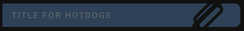

It's what it says on the tin. Title is created from the `name` property and supports an optional `icon`. It has an automatic width and so you can put things next to it in a `horizontal stack` and you can `mirror` it so it goes right-to-left if you need. Examples of these variations can be seen in the image at the beginning of this README.

#### Title Variables

| Variable | Values | Default | Description |
| - | - | - | - |
| `color` | String (CSS) | `var(--cbc-title-color, var(--primary-background-color))` | The color of the icon |
| `text_color` | String (CSS) | `var(--cbc-title-text-color, var(--cbc-title-color, '#ffffff'))` | The color of the title text. |
| `background_color` | String (CSS) | `var(--cbc-title-background-color, var(--accent-color))` | The color of the background |
| `opacity` | Number | `var(--cbc-title-opacity, 0.4)` | Opacity applied to the background color (text remains at full opacity). |
| `uppercase` | Boolean | `true` | Transform the title text to uppercase. |
| `mirror` | Boolean | `false` | Run right-to-left instead of left-to-right |
| `show_tab` | Boolean | `false` | Show a colored tab edge on the card. |
| `offset` | String/Number | `0` | Horizontal offset for the card. |

#### Title Example YAML

<details><summary>See the YAML...</summary><p>

```yaml
type: custom:button-card
template: title
name: Title for Hotdogs
icon: mdi:hotdog
variables:
  color: var(--primary-background-color)
  background_color: var(--state-icon-color)
  mirror: false
```

</p></details>

### Landscape Button (`button_landscape`)

This template serves as the base template for the `device` and `light` templates. You probably won't need to use it yourself until you step up to the advanced  Through it's configuration and addons which it inherits it has features to reduce the card size and opacity if the entity is unavailable, hide the label containing extra information (like attributes or brightness and color for lights) when the entity is `off`, highlight elements when you hover over it to show it's interactive, set a max-height and include the standard set of `actions`.

> :raising_hand_man: _Remember if a template inherits an addon you can just use those variables to change the properties when using this template. For example; a card with only the `button_landscape` template specified can accept the `width` and `height` variables from the `resizable` addon. This is the case for all templates and addons. Also inheritance is recursive so if a template inherits another template it also inherits that templates inherited templates right back through the chain. So when you use the `light` template you get all of the options listed here as well._

#### Landscape Button Inherits

- cbcjs
- state_helper
- [`actions`](#actions-actions)
- [`resizable`](#resizable-resizable)
- interactive

#### Landscape Button Variables

| Variable | Values | Default | Description |
| - | - | - | - |
| `off_hide_info` | Boolean | `true` | Hides the Extra Information or `label` (eg. brightness and color on lights or the attributes on devices) when the entity is off. Set to false if you wish to display this content while the entity is off. _Keep in mind that some attributes are not available when an entity's state is off._ |

### Action Button (`button_action`)

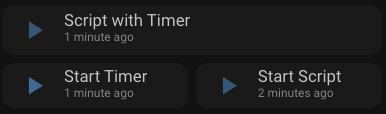

 The Action button is for Automation, Scripts or Timers. It has an animated icon while running and it shows the last run time when idle. You can customise the `name` property which defaults to "Start" and you can also specify a different name while it's running using the `name_on` variable which defaults to "Cancel".

 If you define a `timer` as the `entity` then a tap will start the timer and while active it will show the time remaining and you can tap again to cancel the timer. If you provide a Script or Automation `entity` that starts a timer in it's actions/sequence then you can use the `timer` variable to specify the timer and it will be shown when active, even if the Script/Automation is finished/idle. It will show until the timer runs out or you can double tap to cancel the timer.

#### Action Button Inherits

- cbcjs
- state_helper
- style_helper
- [`dynamic_icons`](#dynamic-icons-dynamic_icons)
- [`resizable`](#resizable-resizable)
- interactive

#### Action Button Variables

| Variable | Value Type | Default | Description |
| - | - | - | - |
| `timer` | `timer.*` | | A timer entity that is started by your script. Not required if your `entity` is already a timer.
| `icon_on` | `mdi:*` | `mdi:stop` | Set a custom icon for while the script/timer is running. Inherited from `dynamic_icons`. You can use the card `icon` property to change the default icon (`mdi:play`). |
| `name_on` | String | `Cancel` | Set a custom name for while the script/timer is running. You can use the card `name` property to change the default name (`Start`). |
| `min_height` | String (CSS) | `40px` | Minimum height of the card. |

#### Action Button Example YAML

<details><summary>See the YAML...</summary><p>

```yaml
- type: custom:button-card   #### Action Script with Timer ####>
  template: button_action
  entity: script.test_script
  name: Script with Timer
  variables:
    height: 50px
    timer: timer.test_timer
  triggers_update: timer.test_timer
- type: grid
  square: false
  columns: 2
  cards:
    - type: custom:button-card   #       #### Action Timer ####>
      template: button_action
      entity: timer.test_timer
      name: Start Timer
      variables:
        height: 45px
        name_on: Cancel Timer
    - type: custom:button-card
      template: button_action
      entity: script.test_script_2 #    #### Action Script ####>
      name: Start Script
      variables:
        height: 45px
        name_on: Stop Script
```

</p></details>

### Mini Button (`button_mini`)

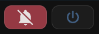

This is a little button which only displays an icon with the option of defining a single text character or another icon as a symbol which will display in front of the main icon. These are great for in a `horizontal-stack` next to the title to control a group or for things like Do Not Disturb (DND) toggles. Of course you can use them for whatever you need. I nearly always add [`dynamic_icons`](#dynamic-icons-dynamic_icons) to them.

> :raising_hand_man: _The first button in the examples is using the button-card `color_type` property set to `card`. Check out all the [button-card options here]_(https://github.com/custom-cards/button-card)

#### Mini Button Inherits

- cbcjs
- style_helper
- state_helper
- [`actions`](#actions-actions)
- show_only_icon
- [`resizable`](#resizable-resizable)
- interactive

> 🧨 _Breaking Change:_ `icon_width` has been replaced with `icon_min_size` / `icon_max_size`, and the default minimum card/icon sizes are now 45px/35px.

#### Mini Button Variables

| Variable | Values | Default | Description |
| - | - | - | - |
| `min_height` | String (CSS) | `45px` | Minimum height of the card. |
| `min_width` | String (CSS) | `45px` | Minimum width of the card. |
| `icon_min_size` | String (CSS) | `35px` | Minimum icon size. Replaces `icon_width`. |
| `icon_max_size` | String (CSS) |  | Maximum icon size (optional). |
| `symbol` | 1-2 Character String OR `mdi:*` |  | 1-2 characters of text or an icon to identify the light |
| `symbol_width` | String (CSS) | `50%` | Only applies if the `symbol` is an icon (`mdi:*`). Adjust if the symbol doesn't fit |
| `symbol_font_size` | String (CSS) | `auto` | Only applies if the `symbol` is a string. Adjust if the symbol doesn't fit |
| `symbol_color` | String (CSS) | `var( --ha-card-background, var(--card-background-color, white) )` | Set a custom symbol color |
| `symbol_margin_top` | String (CSS) | `0` | Adjust vertical positioning for the symbol. |
| `symbol_padding` | String (CSS) |  | Add padding around the symbol. |

#### Mini Button Example YAML

<details><summary>See the YAML...</summary><p>

_See examples of symbol usage in the [`light_group` section](#light-group-light_group)._

```yaml
- type: custom:button-card #          ####| Button Mini DND |####>
  template:
    - button_mini
    - dynamic_icons
  color_type: card
  color: "#9d3042"
  entity: input_boolean.do_not_disturb
  variables:
    icon: mdi:bell
    icon_on: mdi:bell-off
    width: 70px
- type: custom:button-card #        ####| Button Mini Power |####>
  template: button_mini
  icon: mdi:power
  entity: switch.all_things
  variables:
    width: 70px
```

</p></details>

### Entity (`entity`) _previously Device (`device`)_

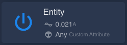

For any `entity` which has on/off state. It can optionally display up to 2 `attributes` from the entity or other entities with custom icons, values and units.

> 🧨 _Breaking Change:_ `device` still works for now but is deprecated in favour of `entity` and is planned for removal in a future `1.x` release.

> :raising_hand_man: _If you don't know what attributes are available on your entity you can use the more-info dialogue or check out the [`entity_details` template](#detailed-entity-information-entity_detail)_

#### Entity Inherits

- `button_landscape`

#### Entity Variables

| Variable | Value Type | Default | Description |
| - | - | - | - |
| `attributes` | Array of [Attribute Items](#attribute-item) | `[]` | A list of up to 2 Attribute Item objects. See [Attribute Item](#attribute-item) below for available properties. |
| `attribute_icon_color` | String (CSS) |  | Set a custom color for the attribute icons. |

#### Attribute Item

| Property | Value Type | Default | Description |
| - | - | - | - |
| `id` | `entity.attributes.*` | - | The id of the attribute to display eg. `friendly_name`. |
| `entity` | `entity_id` | `entity.entity_id` | Optional source entity for this attribute/state. Defaults to the main entity. |
| `use_state` | Boolean | `true` when `entity` is provided, otherwise `false` | Show the entity state instead of an attribute. |
| `icon` | `mdi:*` | - | The icon to use for the attribute. |
| `state` | String | - | Override the displayed value with a custom string. |
| `units` | String | - | The unit of measurement (if required) for the attribute value. |
| `prefix_units` | Boolean | `false` | When `true` units will appear before the value. |

> 🧨 _Breaking Change:_ Attribute rows now deduplicate by `id`, render in a flex row, and `id: state` is replaced by `use_state: true` for showing the main entity state.

#### Entity Example YAML

<details><summary>See the YAML...</summary><p>

```yaml
type: custom:button-card
template: entity
entity: switch.wmd_activate
name: Entity
icon: mdi:nuke
variables:
  attributes:
    - id: voltage
      icon: mdi:alien
      units: Attribute
```

</p></details>

### Smart Plug (`plug`)

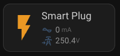

Intended for use with smart plugs which have energy metering attributes. Add the smart plug `entity` and you're good to go. You can also override the default attribute items and source those values from separate entities.

#### Plug Inherits

- `device`

#### Plug Extra information

- **Current:** The current being used currently (lol) from the `current` attribute.
- **Voltage:** The voltage from the `voltage` attribute.
- **Separate attribute sources:** Each attribute item can define its own `entity`, so current/voltage can come from different sensors or helper entities.

#### Plug Example YAML

<details><summary>See the YAML...</summary>
<p>

```yaml
type: custom:button-card
template: plug
entity: switch.smart_plug
name: Smart Plug
variables:
  attributes:
    - id: current
      entity: sensor.smart_plug_current
    - id: voltage
      entity: sensor.smart_plug_voltage
```

</p>
</details>

### Light (`light`)

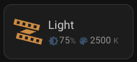

For use with light entities. Just specify the `entity` and the template should do the rest of the work for you. The icon color is set to `auto` so will mimic the current color of the light. _This is a button-card feature and it uses the `--button-card-light-color` css variable_

If the entity exposes `effect_list`, the card will show the active effect name. Enabling the effect selector adds a dropdown to start/stop effects and, where a `select.<light>_theme` (or matching light item theme select) exists, a companion theme picker is shown.

#### Light Inherits

- `button_landscape`

#### Light Extra Information

- **Effects:** If the entity is currently running an effect it will display the effect name derived from the `effect` attribute.

When there is not an effect running:

- **Brightness:** The brightness percentage will be displayed calculated from the `brightness` attribute.
- **Color:** When the entity's attribute `color_mode` is set to `color_temp` the color temperature in degrees Kelvin will be displayed otherwise the `rgb_color` attribute will be displayed.

#### Light Variables

| Variable | Values | Default | Description |
| - | - | - | - |
| `show` | Object |  | Display settings for the light. See [Light Show Options](#light-show-options) below. |
| `attribute_icon_color` | String (CSS) | `var(--state-icon-color)` | Icon color used in the extra information row. |
| `rgb_symbols` | Array of 3 strings | `['R','G','B']` | Override the letters used for RGB display. |
| `strip_show` | Object |  | Show options for the embedded brightness strip. See [Value Strip Show Options](#value-strip-show-options) below. |
| `strip_items` | Array of [Value Strip Items](#value-strip-item) | `[]` | Custom items for the embedded brightness strip. |

#### Light Show Options

| Property | Values | Default | Description |
| - | - | - | - |
| `info` | Boolean | `true` | Show the extra info row (effects / brightness / color). |
| `brightness_strip` | Boolean | `false` | Show the embedded brightness `value_strip`. |
| `effect_selector` | Boolean | `false` | Show the effects dropdown (and theme picker if available). |

To display the effect selector and (if available) theme selector:

```yaml
type: custom:button-card
template: light
entity: light.lounge
variables:
  show:
    effect_selector: true
```

When `show.effect_selector` is enabled, the card will render:
- an **Effects** dropdown if `light.<name>` has an `effect_list`
- a **Theme** dropdown automatically when `select.<light_object_id>_theme` exists.

### Light with Motion Sensor (`light_motion`)

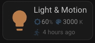

For use with light entities which are controlled by a motion or occupancy sensor. Shows the extra information of the light as well as when occupancy/motion is or was last detected. You specify the light `entity` for the card and then the sensor in the `motion_entity` variable. _The automation for activating the light must already be configured. This button does not provide an automation._

#### Light Motion Inherits

- [`light`](#light-light)

#### Light Motion Variables

| Variable | Values | Default | Description |
| - | - | - | - |
| `motion_entity` | `binary_sensor.*` |  | The `entity_id` of the motion/occupancy sensor which activates the light in your automation. |
| `active_entity` | `input_boolean.*` |  | Optional helper to pause/resume the automation directly from the motion pill. |
| `timer_entity` | `timer.*` |  | Optional timer entity used to show remaining pause time and switch the row to the timer view while active. |

#### Light Motion Example YAML

<details><summary>See the YAML...</summary><p>

```yaml
type: custom:button-card
template: light_motion
entity: light.my_light
variables:
  motion_entity: binary_sensor.my_motion_sensor
```

</p></details>

### Light Group (`light_group`)

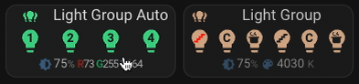

For use with small light groups (up to 6) like multi-globe lamps. Specify a light group and you can have up to 6 separate lights with custom icons and symbols all controlled on one card. The main card controls the group and each individual light can be controlled from an embedded `button_mini`.

If you're feeling lazy then just specify the light group `entity` and up to the first 6 lights from the group will be automagically added to the card for you with lightbulb icons and numbered 1-_n_. Alternatively you can specify the list of lights manually and control the icons and symbols that are used.

#### Light Group Inherits

- [`light`](#light-light)

#### Light Group Variables

| Variable | Values | Default | Description |
| - | - | - | - |
| `items` | Array of [Light Items](#light-item) | `[]` | A list of up to 6 lights to display. See the [Light Item](#light-item) table below for available properties. |
| `item_template` | String (template name) | `button_mini_embed` | Override the template used for each embedded light button. |

#### Light Item

| Property | Values | Default | Description |
| - | - | - | - |
| `entity` | `light.*` | | The `entity_id` of the light _Required_ |
| `icon` |  `mdi:*` | `mdi:lightbulb` | The icon for the light. |
| `symbol` | Single Character String OR `mdi:*` |  | A single character of text or an icon to identify the light |
| `symbol_width` | String (CSS) | `50%` | Only applies if the `symbol` is an icon (`mdi:*`). Adjust if the symbol doesn't fit |
| `symbol_font_size` | String (CSS) | `10pt` | Only applies if the `symbol` is a string. Adjust if the symbol doesn't fit |
| `symbol_color` | String (CSS) | `var( --ha-card-background, var(--card-background-color, white) )` | Set a custom symbol color |

#### Light Group Example YAML

<details><summary>See the YAML...</summary><p>

```yaml
#...
  - type: custom:button-card #                 ####| Light Group Auto |####>
    template:
      - light_group
    entity: light.light_group
    name: Light Group Auto
  - type: custom:button-card #               ####| Light Group Custom |####>
    template:
      - light_group
    entity: light.light_group_passage
    name: Light Group
    variables:
      items:
        - entity: light.stairs
          symbol: mdi:stairs_left
          symbol_color: red
        - entity: light.cabinet_left
          symbol: C
        - entity: light.kitchen_left
          symbol: mdi:pot-steam
        - entity: light.stairs_right
          symbol: mdi:stairs
        - entity: light.cabinet_right
          symbol: C
        - entity: light.kitchen_right
          symbol: mdi:pot-steam
```

</p></details>

### Climate (`climate`)

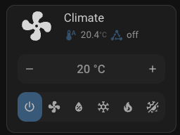

Climate control card that combines the standard entity view with an embedded tile for HVAC mode selection and target temperature adjustments. Supports toggling via a linked `switch_entity` if your setup separates on/off control.

#### Climate Inherits

- `entity`
- [`dynamic_icons`](#dynamic-icons-dynamic_icons)

#### Climate Variables

| Variable | Values | Default | Description |
| - | - | - | - |
| `switch_entity` | `switch.*` | `false` | Optional switch entity to handle on/off outside of the climate domain. |
| `attributes` | Array of [Attribute Items](#attribute-item) | `current_temperature`, `state` | Attribute rows to display under the title. |
| `features` | Array | `target-temperature`, `climate-hvac-modes (icons)` | Tile features to render inside the embedded control. |

#### Climate Example YAML

<details><summary>See the YAML...</summary><p>

```yaml
type: custom:button-card
template: climate
entity: climate.lounge
variables:
  switch_entity: switch.lounge_power
  features:
    - type: target-temperature
    - type: climate-hvac-modes
      style: icons
```

</p></details>

### Cover (`cover`)

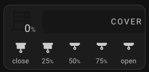

Cover control card for blinds, curtains, shutters, garage doors, and other cover entities with a numeric position. It combines a compact position readout with an embedded `value_strip` configured for cover positions, so you can jump straight to common open/close percentages.

#### Cover Variables

| Variable | Values | Default | Description |
| - | - | - | - |
| `mirror` | Boolean | `true` | Swap the position readout and title from left to right. |
| `position_source` | `entity_id` \| Attribute | `current_position` | Source for the position readout. Use an attribute name from the cover entity or a separate entity ID. |
| `icon_color` | String (CSS) | `#000` | Icon color for the position readout. |
| `icon_opacity` | Number | `0.2` | Icon opacity for the position readout. |
| `title_advanced` | Boolean | `true` | Show the advanced title card instead of the simple button-card name. |
| `title_background_color` | String (CSS) | `#000` | Background color for the advanced title. |
| `title_opacity` | Number | `0.2` | Background opacity for the advanced title. |
| `title_uppercase` | Boolean | `true` | Display the advanced title text in uppercase. |
| `title_text_color` | String (CSS) | `var(--cbc-title-text-color, var(--cbc-title-color, '#ffffff'))` | Text color for the advanced title. |
| `strip_show_icon` | Boolean | `true` | Show icons in the embedded cover `value_strip`. |
| `strip_show_step_value` | Boolean | `true` | Show values or labels in the embedded cover `value_strip`. |
| `strip_show_fade` | Boolean | `false` | Fade strip items according to their position value. |
| `strip_items` | Array of [Value Strip Items](#value-strip-item) | `[]` | Custom cover strip items. Leave empty to use the default `cover` value strip items. |

#### Cover Example YAML

<details><summary>See the YAML...</summary><p>

```yaml
type: custom:button-card
template: cover
entity: cover.lounge_blinds
name: Lounge Blinds
icon: mdi:blinds-horizontal
variables:
  position_source: current_position
  strip_items:
    - step_value: 0
      icon: mdi:blinds
      units: '%'
      label: close
    - step_value: 50
      icon: mdi:blinds-open
      units: '%'
    - step_value: 100
      icon: mdi:blinds-open
      units: '%'
      label: open
```

</p></details>

### Value Strip (`value_strip`)

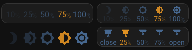

Value strips can be used to control anything which has a gradual, numeric value. The most obvious examples are brightness / color of lights, covers position (like blinds and garage doors) or temperature for environmental controls. Let your imagination run wild though, they can be customised and used for anything you like. They give you quick tap access to 5 pre-set values and if the value of an item matches the value of the target then they are set to active and highlighted.

There are built-in options for `brightness`, `cover`, `adaptive_lighting`, `fan`, `climate`, or a custom `value`. You can also mix item types in a single strip by setting `type` on individual items.


#### Value Strip Variables

| Variable | Property | Values | Default | Description |
| - | - | - | - | - |
| `type` | | `value` \| `brightness` \| `cover` \| `adaptive_lighting` \| `fan` \| `climate` | `value` | The type of value strip. See [Value Strip Types](#value-strip-types) below for descriptions of the available values. |
| `show` | | Object | | Display settings. See [Value Strip Show Options](#value-strip-show-options) below. |
| `items` | | Array of [value strip items](#value-strip-item) | See [Value Strip Types](#value-strip-types) | Define the items in your `value_strip`. See [value strip item](#value-strip-item) below for available properties.

#### Value Strip Show Options

| Property | Values | Default | Description |
| - | - | - | - |
| `icon` | Boolean | `true` | Show the icon for each value. |
| `step_value` | Boolean | `true` | Show the value text and units for each value. |
| `fade` | Boolean | `true` | Fade the items according to their value (best with `brightness`). |

#### Value Strip Types

- **`value`:** _(default)_  This is for creating completely custom Value Strips. You will need to provide the array of `items` to define all 5 items in the strip.
- **`brightness`:** This is for use with a light entity and has five percentage values for brightness. It has the `light.turn_on` service configured in the `tap_action` and highlights the matching value by calculating the brightness percentage from `light.attributes.brightness`. <details><summary>Default items...</summary><p>

  ```yaml
  items:
    - step_value: 10
      units: '%'
      icon: mdi:brightness-3
    - step_value: 25
      units: '%'
      icon: mdi:brightness-4
    - step_value: 50
      units: '%'
      icon: mdi:brightness-5
    - step_value: 75
      units: '%'
      icon: mdi:brightness-6
    - step_value: 100
      units: '%'
      icon: mdi:brightness-7
  ```

</p></details>

- **`cover`:** This is for use with blinds or similar. It has the `cover.set_position` service configured in the `tap_action` and matches the active value using `entity.attributes.current_position`. <details><summary>Default items...</summary><p>

  ```yaml
  items:
    - step_value: 0
      icon: mdi:blinds
      prefix: ''
      units: '%'
      label: close
    - step_value: 25
      icon: mdi:blinds
      units: '%'
    - step_value: 50
      icon: mdi:blinds-open
      units: '%'
    - step_value: 75
      icon: mdi:blinds-open
      units: '%'
    - step_value: 100
      icon: mdi:blinds-open
      units: '%'
      prefix: ''
      label: open
  ```

</p></details>

- **`fan`:** Uses `fan.set_percentage` and matches against `entity.attributes.percentage`. <details><summary>Default items...</summary><p>

  ```yaml
  items:
    - step_value: 10
      icon: mdi:circle-slice-1
      units: '%'
    - step_value: 25
      icon: mdi:circle-slice-2
      units: '%'
    - step_value: 50
      icon: mdi:circle-slice-4
      units: '%'
    - step_value: 75
      icon: mdi:circle-slice-6
      units: '%'
    - step_value: 100
      icon: mdi:circle-slice-8
      units: '%'
  ```

</p></details>

- **`climate`:** Provides temperature setpoints for climate entities via `climate.set_temperature`. <details><summary>Default items...</summary><p>

  ```yaml
  items:
    - step_value: 18
      units: '℃'
      icon: mdi:thermometer-low
    - step_value: 19
      units: '℃'
      icon: mdi:thermometer
    - step_value: 20
      units: '℃'
      icon: mdi:thermometer
    - step_value: 21
      units: '℃'
      icon: mdi:thermometer
    - step_value: 22
      units: '℃'
      icon: mdi:thermometer-high
  ```

</p></details>

- **Mixed:** Any item may override `type` and `entity` to mix different domains on one strip (including item types like `fan_mode`).

#### Value Strip Item

> 🧨 _Breaking Change:_ `step_value` replaces `value` for item values.

| Property | Values | Default | Description |
| - | - | - | - |
| `step_value` | Number | | The value of this item. Used for the action and for display. _Required_ |
| `entity` | `entity_id` |  | Optional source entity for this item. Defaults to the main entity. |
| `type` | `value` \| `brightness` \| `cover` \| `adaptive_lighting` \| `fan` \| `climate` |  | Override the item type for mixed strips. |
| `icon` | `mdi:*` | | The icon for this item |
| `units` | String | | The unit of measurement for the item |
| `prefix` | String | | Any text you would like to prefix before the value. |
| `label` | String | | If provided the label will be displayed instead of the value |
| `opacity` | Number |  | Custom opacity for the item. |
| `color` | String (CSS) | `var(--paper-item-icon-color)` | The color of the item |
| `active_color` | String (CSS) | `var(--button-card-light-color, var(--accent-color))` | The color of the item when it is active (it matches the target value) |

#### Value Strip Example YAML

<details><summary>See the YAML...</summary><p>

_These aren't the same as the example images, no need to include too much YAML!_

```yaml
#...
- type: custom:button-card #      ####| Brightness Strip, Transparent, Only Icons |####>
  template:
    - value_strip
    - transparent
  variables:
    type: brightness
    al_area_id: den
    show:
      icon: true
      step_value: false
- type: custom:button-card #   ####| Custom Cover Strip, Icons and Value, No Fade |####>
  template: value_strip
  entity: cover.den_blinds
  variables:
    type: cover
    show:
      icon: true
      step_value: true
      fade: false
    items:
    - step_value: 0
      icon: mdi:blinds
      units: '%'
      label: close
    - step_value: 25
      icon: mdi:blinds
      units: '%'
    - step_value: 50
      icon: mdi:blinds-open
      units: '%'
    - step_value: 75
      icon: mdi:blinds-open
      units: '%'
    - step_value: 100
      icon: mdi:blinds-open
      units: '%'
      label: open
```

</p></details>

### Select (`select`)

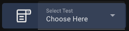

A slim control for Home Assistant select entities, embedding the native dropdown inside a button card. Supports per-state icons/colors through the button-card `state` list.

#### Select Inherits

- show_only_icon
- transparent
- no_actions

#### Select Variables

| Variable | Values | Default | Description |
| - | - | - | - |
| `name` | String | `Select` | Default label shown next to the dropdown. |
| `secondary_info` | `none` \| `last-changed` \| `last-updated` \| ... | `none` | Secondary info mode to pass to the embedded entity row. |
| `color` | String (CSS) |  | Optional icon color override. |
| `state` | Array | `[]` | Standard button-card state array to set icon/color per select option. |

#### Select Example YAML

<details><summary>See the YAML...</summary><p>

```yaml
type: custom:button-card
template: select
entity: select.theme_mode
state:
  - value: "Relax"
    icon: mdi:sofa-outline
    color: "#febe6e"
  - value: "Focus"
    icon: mdi:desk
    color: "#1a89f5"
```

</p></details>

### Info Card (`info`)

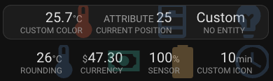

The Info card is for displaying entities and their states or attributes. It's great for displaying sensors. You can display up to 4 items in an info card.

#### Info Inherits

- cbcjs
- no_actions

#### Info Variables

| Variable | Values | Default | Description |
| - | - | - | - |
| `items` | Array of [Info Items](#info-item) | `[]` | A list of up to 4 items. See the [Info Item](#info-item) table below for available properties _Required_ |
| `mini` |  Boolean | `false` | Display using the `info_mini` template rather than the `info_item` one |
| `icon_color` | String (CSS) | `var(--state-icon-color, var(--paper-item-icon-color))` | Set the color of the icons. This will be overridden by a `color` set on any individual items.  |

#### Info Item

| Property | Values | Default | Description |
| - | - | - | - |
| `entity_id` | Any entity | | The `entity_id` of the item |
| `attribute` | `entity.attributes.*` | | The id of any attribute of the entity specified above. If provided the value of the attribute will be used rather than the entity state. |
| `state` | String | | Providing this will completely override the `entity_id` and `attribute` states and display this string instead. You don't need to specify an `entity_id` if you use this. |
| `units` | String | The entity attribute `unit_of_measurement` | Set a custom unit of measurement for the displayed value |
| `prefix_units` | Boolean | `false` | Display the `units` in front of the value rather than after. Automatically `true` for `$` and `€` units |
| `decimals` | Number | | Round the value to the specified number of decimal places (`0` for a whole number). Automatically `2` for `$` and `€` units |
| `name` | String | The entity `friendly_name` or the attribute name | Set a custom display name for the item |
| `icon` |  `mdi:*` | The entity icon | The icon for the entity. |
| `color` | String (CSS) | `variables.icon_color` | Set a custom color for the icon |

#### Info Example YAML

<details><summary>See the YAML...</summary><p>

```yaml
# ...
- type: custom:button-card #                     ####| Info x 3 |####>
  template: info
  variables:
    items:
      - entity_id: sensor.temperature
        name: Custom Color
        color: '#e04632'
        decimals: 2
      - entity_id: cover.blinds
        attribute: current_position
        units: 'ATTRIBUTE '
        prefix_units: true
      - icon: mdi:lightbulb-variant
        name: No Entity
        state: 'Custom'
- type: custom:button-card #         ####| Info x 4 Transparent |####>
  template:
    - info
    - transparent
  variables:
    items:
      - entity_id: sensor.temperature
        name: Rounding
        decimals: 0
      - icon: mdi:cash
        name: Currency
        state: '47.3'
        units: '$'
        color: "#00b59d"
      - entity_id: sensor.battery
        name: "Sensor"
        color: "#febe6e"
      - entity_id: input_number.some_counter
        name: Custom Icon
        icon: mdi:clock-outline
```

</p></details>

### Mini Info (`info_mini`)

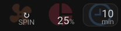

Displays the icon and state of an entity only. Good for displaying information next to a `title` in a `horizontal-stack`. You can choose between `stack` and `inline` layouts for the state and units. Specify the `entity` and optionally `icon` properties then the other options are in `variables`.

#### Mini Info Variables

| Variable | Values | Default | Description |
| - | - | - | - |
| `layout` | `stack` \| `inline` | `stack` | `stack` will show the state with units underneath and `inline` shows the state followed by the units. |
| `show_name` | Boolean | `false` | Show a small name label under the value. |
| `attribute` | `entity.attributes.*` | | The id of any attribute of the entity specified above. If provided the value of the attribute will be used rather than the entity state. |
| `state` | String | | Providing this will completely override the `entity` and `attribute` states and display this string instead. |
| `units` | String | The entity attribute `unit_of_measurement` | Set a custom unit of measurement for the displayed value |
| `prefix_units` | Boolean | `false` | Display the `units` in front of the value rather than after. Automatically `true` for `$` and `€` units |
| `decimals` | Number | | Round the value to the specified number of decimal places (`0` for a whole number). Automatically `2` for `$` and `€` units |
| `icon_color` | String (CSS) | `var(--state-icon-color, var(--paper-item-icon-color))` | Set a custom color for the icon |
| `icon_opactiy` | Number | `0` | Override icon opacity (transparent templates default to full opacity). |
| `icon_offset_x` | Number/String | `0` | Horizontal offset for the icon (percentage or CSS length). |
| `icon_offset_y` | Number/String | `0` | Vertical offset for the icon (percentage or CSS length). |

`rotate` is supported as an alias for `spin`.

#### Mini Info Example YAML

<details><summary>See the YAML...</summary><p>

```yaml
# ...
- type: custom:button-card #                     ####| Spin |####>
  template:
    - transparent
    - info_mini
  entity: cover.den_blinds
  variables:
    attribute: current_position
    units: 'SPIN'
    state: '↻'
    rotate: true
    icon_color: 'rgba(247, 138, 80, 0.2)'
  icon: mdi:fan
- type: custom:button-card #                   ####| Inline |####>
  template:
    - info_mini
    - transparent
  entity: sensor.percentage
  icon: mdi:chart-pie
  variables:
    icon_color: 'rgba(157, 48, 66, 0.4)'
    layout: inline
    attribute: current_position
    units: '%'
  - type: custom:button-card #               ####| Background |####>
    template: info_mini
    entity: input_number.some_time
    icon: mdi:clock-time-nine-outline
```

</p></details>

## Addons

You can use any addon by including it after your template in a list as shown in the example above. Addons with a star (*) are included in _most_ templates already.

### Date Time (`datetime`)

Adds a shared `__dateString(date, format)` helper function for formatting dates in templates and addons. Supports `full`, `short`, `next`, `relative`, `day`, and `month` output modes. _This is obsolete now that button-card have their own helper functions and may be deprecated and removed in future versions!_

### Actions (`actions`)*

The `actions` addon will add the `toggle` action for single tap and `more-info` action for hold and double tap as well as the haptic `success` for the iOS app. It's included in most of the button templates by default.

### No Actions (`no_actions`)

The `no_actions` addon does the opposite of above. It removes the standard functionality and sets your card to have no actions.

### Dynamic Icons (`dynamic_icons`)

The `dynamic_icons` addon will add functionality to the card which will change the icon dependant on the state of the entity. It works for all entities that have an "on" and "off" state.

> :raising_hand_man: _If you just want to have a static custom icon for your card then it's easiest just to populate the `icon` property of your button-card. You only need to use this addon if you would like different icons for different states._

#### Dynamic Icon Variables

| Variable | Values | Default | Description |
| - | - | - | - |
| `icon` | `mdi:*` | `mdi:toggle-switch-off` | The icon to display when the entity is off. |
| `icon_on` | `mdi:*` | `mdi:toggle-switch` | The icon to display when the entity is on. |
| `icon_unavailable` | `mdi:*` | `mdi:wifi-cancel` | The icon to display when the entity is unavailable. |

### Resizable (`resizable`)*

The `resizable` addon allows you to use `height` and `width` variables to define the size of the card (some templates have min or max sizes set though). It's added to most button templates already so you only need to include the variables to set a custom size for your card.

#### Resizable Variables

| Variable | Values | Default | Description |
| - | - | - | - |
| `height` | String (CSS) | _per card_ | The height of the card in any CSS accepted value. Eg `40px` or `90%` |
| `width` | String (CSS) | _per card_ | The width of the card in any CSS accepted value. Eg `40px` or `90%` |
| `min_height` | String (CSS) | _per card_ | The minimum height of the card in any CSS accepted value. |
| `min_width` | String (CSS) | _per card_ | The minimum width of the card in any CSS accepted value. |
| `max_height` | String (CSS) | _per card_ | The maximum height of the card in any CSS accepted value. |
| `max_width` | String (CSS) | _per card_ | The maximum width of the card in any CSS accepted value. |

### Transparent (`transparent`)

The `transparent` addon will make the background of your card transparent, remove it's `box-shadow` and `border`. I find this looks great with `value_strip` and `info_mini` templates but you can use it on any you like.

## Advanced Usage

There are some addons and cards which are really only going to be of interest to you if you want to customise cards or are having some issues you don't understand.

### CBC JS (`cbcjs`)*

Shared client-side helper that powers effect/theme dropdowns, select option calls, and version checking. Included by default on most templates that need in-card scripting. Essential for most cards to work as expected.

### Button-Card Config (`bc_config`)

Exposes the resolved button-card config object to templates as variabe `__config`, this gives you access to perform advanced actions in your Javascript based on items other than the variables. If you're not sure what it's for, best to leave it alone!

### Debug

When added to a card's `template` list `debug` will write a `console.debug()` containing objects that can help you figure out what's happening. So in your browser inspector console you can see the button-card (`this`), the `variables`, `entity` objects and more. It comes in handy if things aren't working. If you're going to submit a issue on GitHub you'll need to be able to get this info. Remember to set the level of your browser console to All so you can see the debug messages. `debug_hass` now defaults to `true` and can be disabled via variables if needed._

#### Debug Variables

| Variable | Values | Default | Description |
| - | - | - | - |
| `debug_hass` | Boolean | `true` | Include the full `hass` object in the console output. |
| `debug_extras` | Object | `{}` | Extra data to include in the debug output. |

### Detailed Entity Information (`entity_detail`)

Mostly used for creating and debugging the templates this card displays the full properties and attributes of an entity in a table.

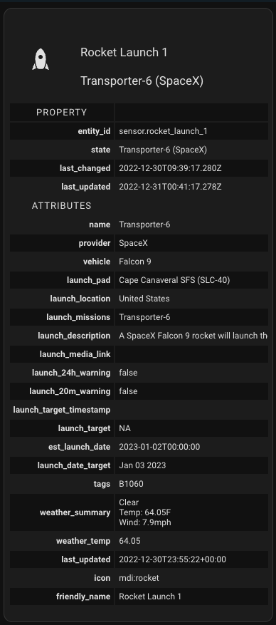

#### Entity Detail Variables

| Variable | Values | Default | Description |
| - | - | - | - |
| `do_not_split` | Array of attribute names | `[]` | Attributes to keep as a single value (prevents splitting on `,` or `|`). |

## Changes and Custom Cards

> :warning: DO NOT MAKE CHANGES TO THE ORIGINAL TEMPLATES. There's no support for that, your changes will be lost if you update and everyone will be unhappy campers. There's a better way...

If you wish to change or expand on one of the templates you can create a new file under `custom/yourcardname.yaml` and it will be picked up and loaded with the rest or in Storage mode (UI) it will be exported with `bin/export` into `cbc.yml` ready to COPY-PASTE with the rest. Obviously, replace _yourcardname_ with your card name and make it unique. __It cannot be the same as an existing template name, that WILL end in tears!__ :sob:

Let's say I wanted to make a transparent light card which always has the brightness strip showing with certain settings so I don't have to put them in each time. I could make the following `custom/showy_light.yaml`:

```yaml
showy_light:
  template:
    - light
    - transparent
  variables:
   show:
      brightness_strip: true
    strip_show:
      icon: true
      step_value: false
      fade: true
```

Then when I'm placing the lights in the dashboard:

```yaml
- type: custom:button-card
  template: showy_light
  entity: light.lamp
  # ..
```

You're not limited to `variables` you can override any other property from the template with your own. If you wanted to get really advanced you can copy properties or the entire contents from `light.yaml` and copy it to `custom/showy_light.yaml` and then change the appropriate ones.

> :raising_hand_man: __If you do this, make sure you change the template name (eg. `light:` to `showy_light:`) or else the tears :sob: again!__

My **strong** suggestion is to use the method of loading the template and overriding only what you need to change though because they can get a tad complicated especially when you consider the inherited templates. If you're comfortable with YAML and (poorly-written, buttoncardworkaroundesque) Javascript then you should be fine with whatever you find.

Include any templates and addons you want in your customs or make them from scratch! Just have fun and be CREATIVE with them!

## Settings

Rename `

## Version Check

As of version 0.3^ there is a automated check so you can know if there are updates available in the future. **This feature does not send any data from your instance to any external server.** This is optional and you can set the check frequency and notifications in `addons/_cbc_settings.yaml`.

#### Version Check Settings `variables.__cbc_settings.check_version:`

| Variable | Values | Default | Description |
| - | - | - | - |
| `auto` | Boolean (true/false) | `true` | Should CBC Check for updates. |
| `frequency` | Number (7 - 90) | `14` | How often to check for updates (in days). This is reset if you clear your browser's local storage for your Home Assistant domain. Check is performed once on first run, and then according to the check frequency.|
| `notify` | Boolean (true/false) | `true` | If an update is available show a 5 sec notification at the bottom of the dashboard on first load with a link to get the update. |

> :raising_hand_man: _There is no data from your Home Assistant instance sent to any external server by the version check._

## Usage Stats

You can also track your usage of the templates with the built in Usage Stats. This is completely optional and is not sent to any external server. Once enabled in `addons/_cbc_settings.yaml` by setting `generate` to `true`, you can view stats by opening your web browser console and typing `cbcJS.getStats()`. This will show you the stats object which contains the number of times each card and template has been used in your dashboards. You can reset these stats by clearing your browser's local storage for your Home Assistant domain.

If you wish to share the usage data with others, you may not want to include your dashboard (panel) names. Setting `hash_panels` to `true` will anonymise your dashboard (panel) names in the stats.

### View Usage Stats

Make sure you have set `variables.__cbc_settings.stats.generate` to `true` in `addons/_cbc_settings.yaml` and then you can view the stats with the following command in your browser console:

```javascript
// From your dashbaord, open your browser console and type:
cbcJS.getStats()
```

#### Usage Stats Settings `variables.__cbc_settings.stats:`

| Variable | Values | Default | Description |
| - | - | - | - |
| `generate` | Boolean (true/false) | `false` | Generate usage statistics. |
| `hash_panels` | Boolean (true/false) | `false` | Anonymise dashboard (panel) names. |

> :raising_hand_man: _I'd like to collect anonymous usage data so that I can focus on the most popular cards for improving later versions and ultimately creating a complete dashboard plugin. To see an example of the data I would like to collect, see Usage Stats below. Please [join the discussion]() to give your opinion on this._

## Thanks

Massive thanks to [@RomRider](https://github.com/RomRider) and everyone who contributed to [Button Card](https://github.com/custom-cards/button-card) which is the only reason these templates were possible.

And thanks to all of you for your patience while it's been too long between updates! I'd love to see what you're building with the templates. Post some images of your dashboards on the [Home Assistant Forum thread](https://community.home-assistant.io/t/creative-button-card-templates-for-lovelace-dashboards/515667).
